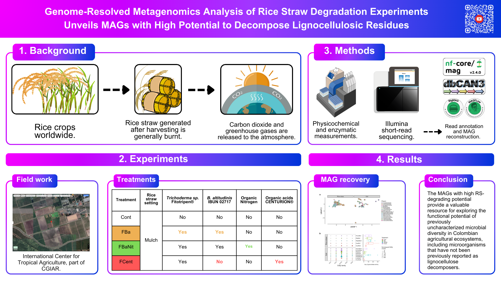

# Genome-resolved metagenomics of rice straw degradation experiments unveils MAGs with high potential to decompose lignocellulosic residues

Repository containing a github-pages website to display the paper figures in a different format. The website is available [here](https://jeffe107.github.io/metagenomics-report/) and you can learn more about our project with this [video](https://www.youtube.com/watch?v=xxSlu5Gj-zo).

## Abstract

    

