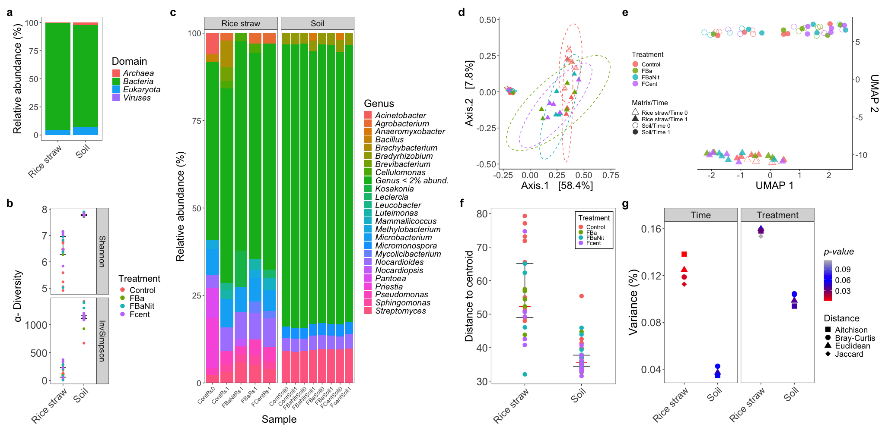
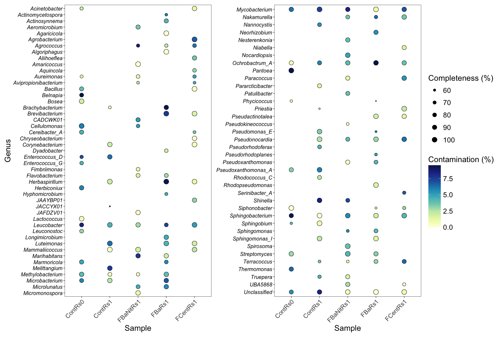
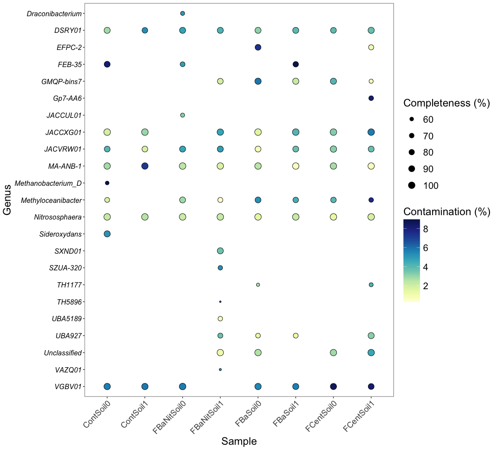
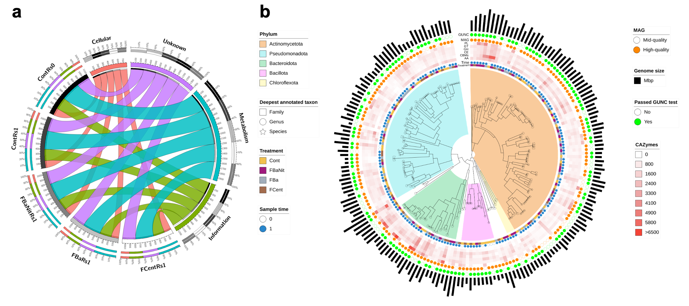
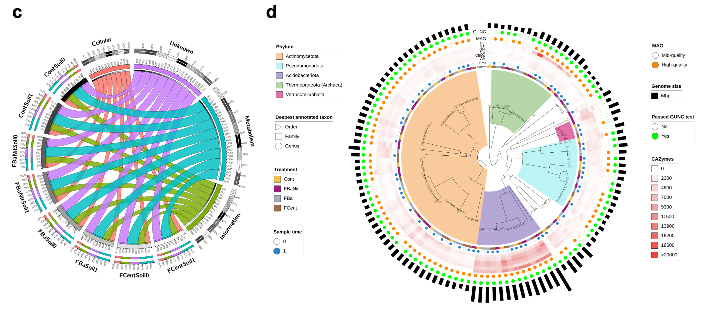
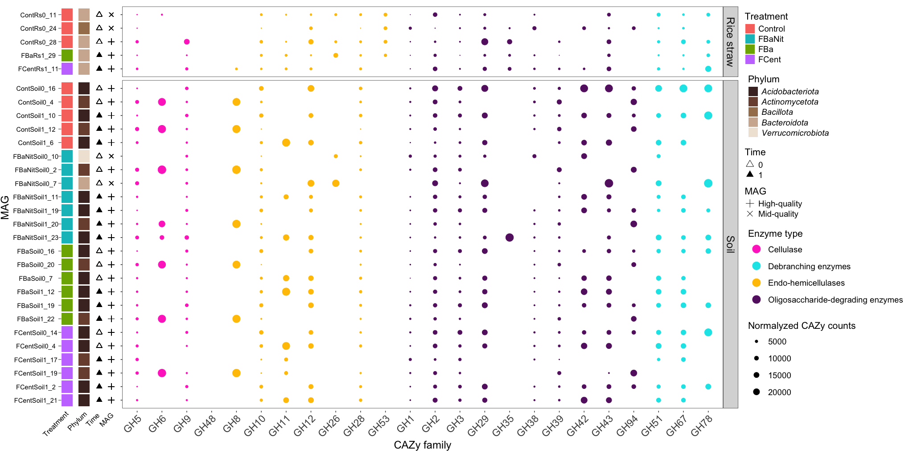

```{r setup, include=FALSE}
knitr::opts_chunk$set(echo = TRUE)
```

# Report for publication

**Appreciated group members,**

<p style='text-align: justify;'>I hereby share with you the processed results after following different approaches to analyze the data generated during the assays at field scale. The intention of this document is serve as basis to start writing the manuscript in which all the process will be documented.</p>

One tip before navigate through this document:

> 🚀   **Please click on the images to enlarge them.**

# Methodology

## Taxonomic profiling

<p style='text-align: justify;'>We used Kraken2/Bracken to perform taxonomic assignment of the reads. The procedure included the remotion of reads mapping the rice genome ([O. zativa, Build_4.0](https://bowtie-bio.sourceforge.net/bowtie2/manual.shtml)). The workflow is proposed by Lu et al. (2022) as follows (wrapped by Nextflow):</p>

{style="display: block; margin: 0 auto"}

<p style='text-align: justify;'>The analysis of the raw counts was developed by wrapping the output as a Phyloseq object to estimate effect of treatments and time over relative abundance, α-Diversity, β-Diversity and differentially abundant taxa.</p>

## MAG recovery

<p style='text-align: justify;'>nf-core/mag was implemented to build and annotate the MAGs from the raw sequences. A co-assembly/co-binning strategy was chosen as an attempt to improve the quality and resolution of the MAGs. MEGAHIT was used for the assembly, while MaxBin2 and MetaBAT2 were the selected tools for binning. A de-replication and refinement step was carried by enabling DASTool within the workflow. For the downstream analysis, the curated MAGs were analyzed with MAGFlow/BIgMAG, that includes quality-measuring tools such as CheckM2, BUSCO, GUNC and QUAST, as well as the taxonomic annotator GTDB-Tk2 relying on the database version R220. The presence of carbohydrate-related metabolism enzymes was studied through dbCAN3 along with the [CAZy](https://dbcan.readthedocs.io/en/latest/index.html) database, whilst Cluster of Orthologous Genes (COGs) were detected by COGclassifier. For data visualization, Circos, iTOL and ggplot2 packages were used.</p>

{style="display: block; margin: 0 auto"}

# Results

## Relative abundance, α-Diversity and β-Diversity

{style="display: block; margin: 0 auto"}

> **Figure 1.** Taxonomic profiling of the sequences using Kraken2/Bracken: **a** Relative domain abundance per matrix source, merging all the replicates per sample. **b** α-Diversity, colored by Treatment, measured through Shannon and Inversed-Simpson indices. **c** Relative genus abundance of agglomerated data at this level for each of sample (merged replicates), divided by matrix source. Only genera with relative abundance above 2% are displayed. **d** Sample ordination through Principal Coordinate Analysis (PCoA) using a Bray-Curtis dissimilarity matrix as input. The ellipses represent 95% confidence regions around the centroids of each group calculated by the assumption of multivariate t-distribution. **e** Two-dimensional Uniform Manifold Approximation and Projection (UMAP) embedding of β-Diversity estimation of the samples based on the Aitchison distance. **f** Compositional variability of the samples, measured as distance to the centroid in a multivariate space computed with the Aitchison distance among samples. ANOVA analysis results show no significant differences in terms of group dispersion. **g** Proportion of the variance explained by the factors Time and Treatment, segmented by matrix source, in Permutational Analysis of Variance (PERMANOVA) implemented according to different distance/dissimilarity metrics. The significance of the each factor is determined by the symbol color. All the analysis from **b** to **g** were carried out only with Bacteria data and with normalized raw counts as Counts per million (CPM). The Treatment colors are transversal to plots **b**, **d**, **e** and **f**.

## Differentially abundant taxa

{style="display: block; margin: 0 auto"}

> **Figure 2.** ANCOM-BC2-selected differentially abundant genera in rice straw (**a**) and soil (**b**) samples. Right: Log2FC of Treatments to Control. Left: Boxplots of selected genera abundance (counts) in log10 scale. All displayed genera exhibit p-value < 0.05 adjusted with Holm–Bonferroni method for multiple comparisons. Cont0 and Cont1 in rice straw comparisons indicate Control samples at Time 0 and 1, respectively. As a result, rice straw results depict differences throughout time for all treatments including Control. In the case of soil samples, Time 0 and Time 1 were merged for each Treatment since Permutational Analysis of Variance (PERMANOVA) results does not show significant differences for this factor. ANCOM-BC2 was implemented only with Bacteria data, agglomerated at genus level and taxa abundant in at least 0.5% and 0.05% (any sample) for rice straw and soil samples, respectively.

## MAG summary with MAGFlow/BIgMAG

{style="display: block; margin: 0 auto"}

> **Figure 3.** BIgMAG summaries of the bins recovered from rice straw (**a**) and soil (**b**) samples describing the proportion of: annotated MAGs at species/genus level and unique annotated MAGs using GTDB-Tk2; mid-quality and high-quality MAGs according to CheckM2 estimations; and bins passing the GUNC test.

## Presence/absence of genera across samples according to GTDB-Tk2 annotation

{style="display: block; margin: 0 auto"}

> **Figure 4.** Presence/absence of MAGs annotated with GTDB-Tk2 in **rice straw** samples at **genus** level. Completeness percentage is indicated as the point size, while contamination proportion is specified by the color scale.

{style="display: block; margin: 0 auto"}

> **Figure 5.** Presence/absence of MAGs annotated with GTDB-Tk2 in **soil** samples at **genus** level. Completeness percentage is indicated as the point size, while contamination proportion is specified by the color scale.

## COG detection and CAZy annotation

{style="display: block; margin: 0 auto"}

{style="display: block; margin: 0 auto"}

> **Figure 6.** **a**, **c** Circos plots showing the proportion of the 4 main categories (**Metabolism**; **Information** Storage and Processing; **Cellular** Processes and Signaling; and Protein Coding Sequences with **Unknown** function) of Clusters of Orthologs Genes (COGs) found within the MAGs recovered from the samples. The inner ring accounts for the total number of COGs related to every sample or COG category; the outer ring depicts the relative abundance of COGs from each sample or COG category; the width of the ribbons linking any sample and a COG category depicts their relative abundance to each other. The number of counts per category was normalized using the total number of genes found per MAG. **b**, **d** Recovered MAGs from the samples belonging to each treatment. The visualization includes phylogenetic relationship among them (tree), specific highlighted phylum clades (colored sectors), deepest annotated taxon per MAG (tips), Treatment and Time information (blue binary), classification as either high-quality or mid-quality MAG (orange binary), GUNC test passing or not (green binary), genome size in Mbp (outer black bars) and CAZy enzyme class normalized abundance (red scaled heatmap). GH glycoside hydrolases, GT glyco-syltransferases, PL polysaccharide lyases, CE carbohydrate esterases, CBMs carbohydrate-binding modules, AA auxiliary activities. **Top:** rice straw samples; **Bottom**: soil samples.

## MAG clustering using CAZy information and β-glucosidase activity estimation

{style="display: block; margin: 0 auto"}

> **Figure 7. a** Two-dimensional Uniform Manifold Approximation and Projection (UMAP) embedding of normalized CAZy enzymes counts per MAG colored by phylum (GTDB-Tk2). All CAZy classes (GH, GT, PL, CE, AA and CBMs), along with all their families, were considered for clustering using default values (15 neighbors and Euclidean distance). **b** **Left:** dendrogram of the samples according the normalized CAZy counts for β-glucosidase families (GH1, GH3, GH5 and GH9). **Middle:** number of normalized counts as function of point size. **Right:** data distribution for experimental β-glucosidase activity quantified per sample. The values represent the median of the counts of each CAZy family per sample and Treatment colors are shared by both the bubble plot and the boxplot.

## Abundance of CAZy-derived lignocellulose-degrading enzymes per MAG

{style="display: block; margin: 0 auto"}

> **Figure 8.** Bubble plot depicting the number of normalized CAZy counts for GH families associated with lignocellulose-degrading enzymes found in the MAGs recovered from rice straw (**top**) and soil (**bottom**) samples. Visualization includes (from left to right): Treatment origin of the MAG, phylum information (GTDB-Tk2), Time (0: initial, 1: after 30 days of Treatment) and classification as mid-quality or high-quality MAG (CheckM2). MAGs were filtered considering only the ones with at least 5000 normalized counts in 5 or more GH families.
