```{r setup, include=FALSE}
knitr::opts_chunk$set(echo = TRUE)
knitr::opts_chunk$set(warning = FALSE, message = FALSE) 
```

**Department of Biology**, University of Fribourg, Fribourg, Canton of Fribourg, 1700, Switzerland

**Swiss Institute of Bioinformatics**, Lausanne, Vaud, 1015, Switzerland

**Agricultural Microbiology Group**, Biotechnology Institute, Universidad Nacional de Colombia, A.A 14-490, Bogotá D.C., Colombia

**Department of Soil and Water Systems**, University of Idaho, 875 Perimeter Drive MS2340, Moscow, ID 83844-2340, United States of America

**Bioinformatics group**, Biotechnology Institute, Universidad Nacional de Colombia, A.A 14-490, Bogotá D.C., Colombia

Correspondence should be addressed to L.F (laurent.falquet@unifr.ch)

# Abstract

<p style='text-align: justify;'>**Background**
Rice is one of the top three crops that contribute 60% of the calories consumed by humans worldwide. Nonetheless, extensive rice harvesting yields more than 700 tons of rice straw, a byproduct that is often difficult for farmers to manage efficiently. As a result, millions of tons of carbon dioxide and greenhouse gases are released, causing issues such as respiratory problems, soil degradation and global warming. In this work, we explore the biological decomposition of rice straw through the application of microbial consortia from a metagenomics perspective.</p>

<p style='text-align: justify;'>**Results**
We applied different treatments to rice straw placed in a mulching setup at field scale, using various combinations of a Trichoderma-based commercial product, the bacterial strain Bacillus altitudinis, organic nitrogen, and a mixture of organic carbon and acids. After 30 days, we characterized the microbiome community on the surface of the material and from the soil by reconstructing and functionally annotating Metagenome-Assembled Genomes (MAGs), and comparing it with the initial microbial composition. The metagenomics data analysis allowed for the recovery of high-quality MAGs that exhibit the potential to decompose rice straw, as they possess the enzymatic machinery to metabolize the main components of the plant cell wall. Additionally, in soil samples, the MAGs with the highest potential to utilize lignocellulosic residues as carbon are grouped together under the phyla Actinomycetota and Acidobacteriota. Moreover, these experiments revealed an increase in β-glucosidase activity following treatment application, along with an improvement in the total carbon quantified in the soil; however, interestingly, in some cases, although the presence of genes related to β-glucosidase synthesis was established, no experimental activity was quantified.</p>

<p style='text-align: justify;'>**Conclusions**
This contribution underscores the applicability of different biological strategies to convert rice straw into a more assimilable substrate. The abundance of MAGs detected with the ability to decompose rice straw indicates that the proposed treatments may trigger their activation and subsequent activity. The fact that high-quality MAGs account for the potential to metabolize rice straw, yet no experimental degradation was detected, highlights the need for further study of expression patterns in this context.<p style='text-align: justify;'>
</p>

## Graphical Abstract

{style="display: block; margin: 0 auto"}

> 🚀   **Please click on the images to enlarge them.**

# Methodology

## Taxonomic profiling

<p style='text-align: justify;'>We used Kraken2/Bracken to perform taxonomic assignment of the reads. The procedure included the remotion of reads mapping the rice genome ([O. zativa, Build_4.0](https://bowtie-bio.sourceforge.net/bowtie2/manual.shtml)). The workflow is proposed by Lu et al. (2022) as follows (wrapped by Nextflow):</p>

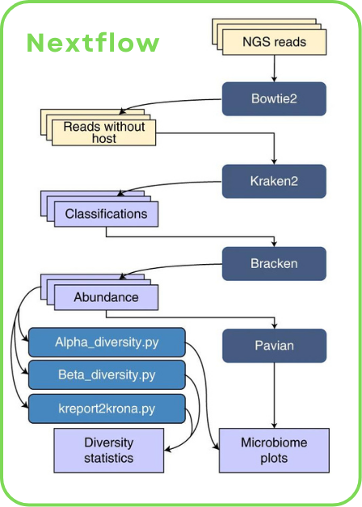{style="display: block; margin: 0 auto"}

<p style='text-align: justify;'>The analysis of the raw counts was developed by wrapping the output as a Phyloseq object to estimate effect of treatments and time over relative abundance, α-Diversity, β-Diversity and differentially abundant taxa.</p>

## Metagenome-Assembled Genome (MAG) recovery

<p style='text-align: justify;'>nf-core/mag was implemented to build and annotate the MAGs from the raw sequences. A co-assembly/co-binning strategy was chosen as an attempt to improve the quality and resolution of the MAGs. MEGAHIT was used for the assembly, while MaxBin2 and MetaBAT2 were the selected tools for binning. A de-replication and refinement step was carried by enabling DASTool within the workflow. For the downstream analysis, the curated MAGs were analyzed with MAGFlow/BIgMAG, that includes quality-measuring tools such as CheckM2, BUSCO, GUNC and QUAST, as well as the taxonomic annotator GTDB-Tk2 relying on the database version R220. The presence of carbohydrate-related metabolism enzymes was studied through dbCAN3 along with the [CAZy](https://dbcan.readthedocs.io/en/latest/index.html) database, whilst Cluster of Orthologous Genes (COGs) were detected by COGclassifier. The selection of the MAGs was carried out using the criteria: completeness above 50% and contamination below 10%. In addition, MAGS belonging to either rice straw or soil with average differences <5% ANI were clustered using FastANI. For data visualization, Circos, iTOL and ggplot2 packages were used.</p>

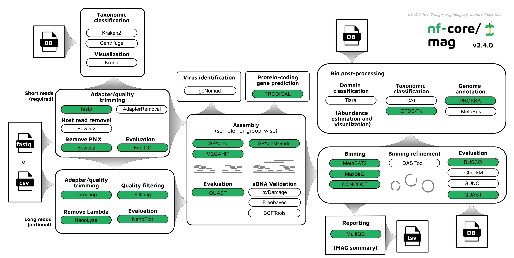{style="display: block; margin: 0 auto"}

# Results Taxonomic Profiling

## Relative abundance, α-Diversity and β-Diversity

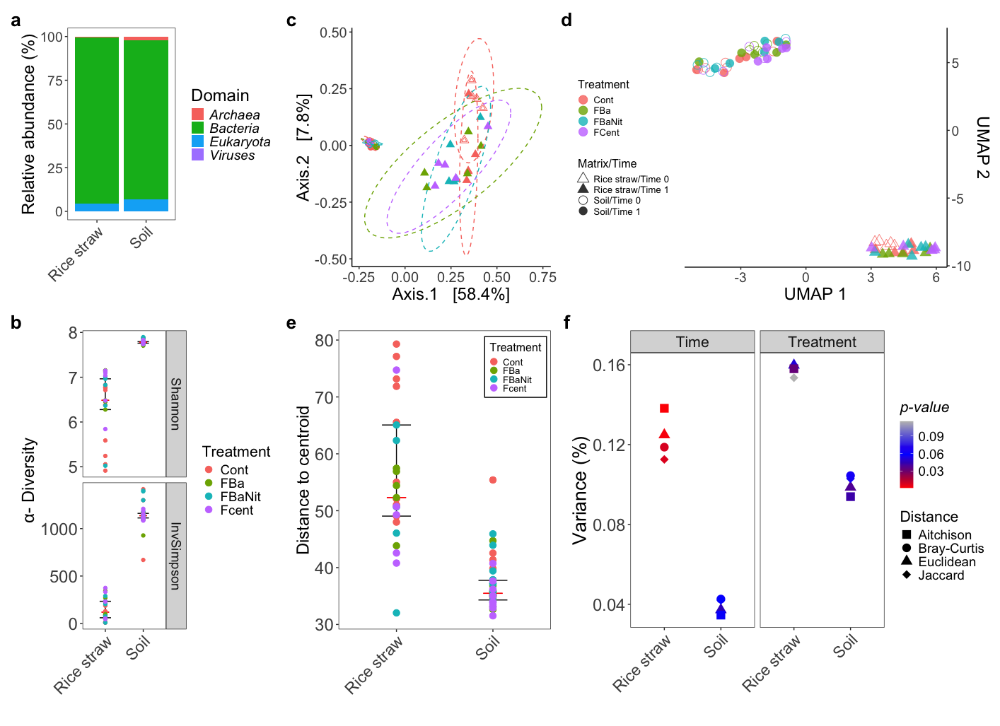{style="display: block; margin: 0 auto"}

> **Figure 1.** Taxonomic profiling of the sequences using Kraken2 coupled to Bracken: **a** Relative domain abundance per matrix source, merging all the replicates per sample. **b** α-Diversity, colored by Treatment, measured through Shannon and Inversed-Simpson indices. **c** Sample ordination through Principal Coordinate Analysis (PCoA) using a Bray-Curtis dissimilarity matrix as input. The ellipses represent 95% confidence regions around the centroids of each group calculated by the assumption of multivariate t-distribution. **d** Two-dimensional Uniform Manifold Approximation and Projection (UMAP) embedding of β-Diversity estimation of the samples based on the Aitchison distance. **e** Compositional variability of the samples, measured as distance to the centroid in a multivariate space computed with the Aitchison distance among samples. ANOVA analysis results show no significant differences in terms of group dispersion. **f** Proportion of the variance explained by the factors Time and Treatment, segmented by matrix source, in Permutational Analysis of Variance (PERMANOVA) implemented according to different distance/dissimilarity metrics. The significance of the each factor is determined by the symbol color. All the analysis from **b** to **f** were carried out only with Bacteria data and with normalized raw counts as Counts per million (CPM). The Treatment colors are transversal to plots **b**, **d**, **e** and **f**.

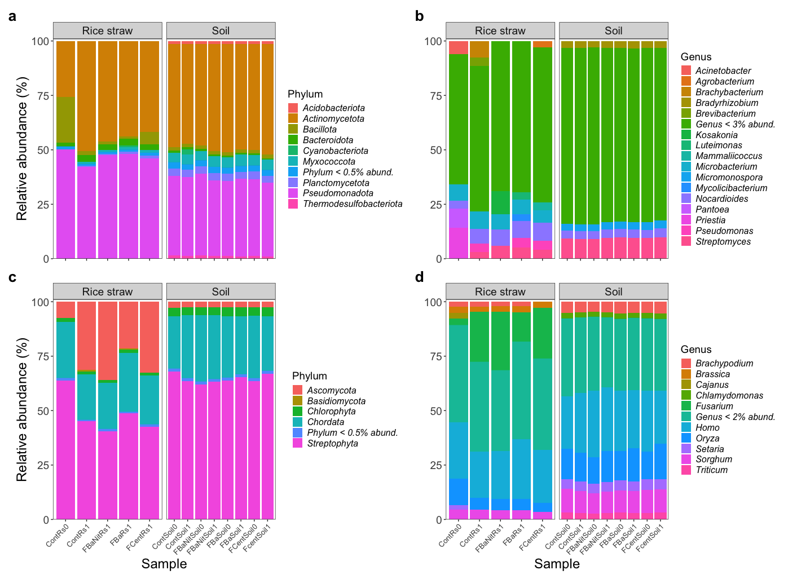{style="display: block; margin: 0 auto"}

> **Figure 2.** Relative **phylum** (**a**, **c**) and **genus** (**b**, **d**) abundance of agglomerated data, generated by Kraken2 coupled to Bracken, for _**Bacteria**_ (**top**) and _**Eukaryota**_ (**bottom**). The displayed abundance is part only of the portion of the reads belonging to each **domain** ( _see_ **Figure 1a** and **Figure S1**). Replicates were merged, and the panels are divided by matrix source. On phylum plots, only phyla with relative abundance above 0.5% are displayed, whilst on genus plots genera above 3% and 2% are depicted for _Bacteria_ and _Eukaryota_, respectively.

## Differentially abundant taxa

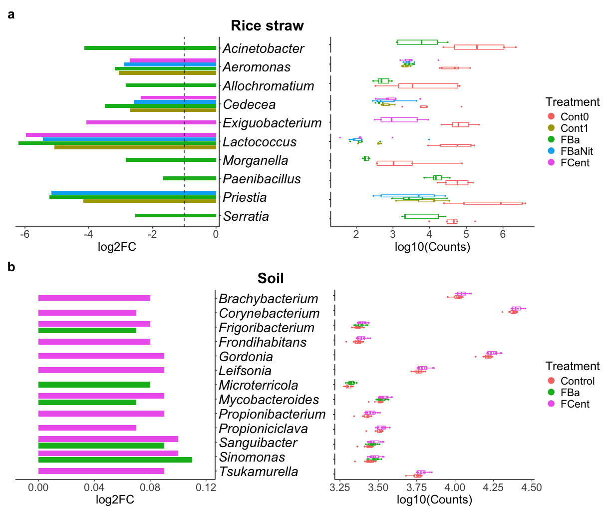{style="display: block; margin: 0 auto"}

> **Figure 3.** Selected differentially abundant genera in **rice straw** (**a**) and **soil** (**b**) samples based on Analysis of Compositions of Microbiomes with Bias Correction 2 (ANCOM-BC2). Right: Log2FC of Treatments to Control. Left: Boxplots of selected genera abundance (counts) in log10 scale. All displayed genera exhibit p-value < 0.05 adjusted with Holm–Bonferroni method for multiple comparisons. _Cont0_ and _Cont1_ in rice straw comparisons indicate Control samples at _Time_ 0 and 1, respectively. As a result, rice straw results depict differences throughout time for all treatments including Control. In the case of soil samples, Time 0 and Time 1 were merged for each Treatment since Permutational Analysis of Variance (PERMANOVA) results does not show significant differences for this factor. ANCOM-BC2 was implemented only with Bacteria data, agglomerated at genus level and taxa abundant in at least 0.5% and 0.05% (any sample) for rice straw and soil samples, respectively.

# Results Metagenome-Assembled Genome (MAG) recovery

## Summary and presence/absence of genera across samples according to GTDB-Tk2 annotation

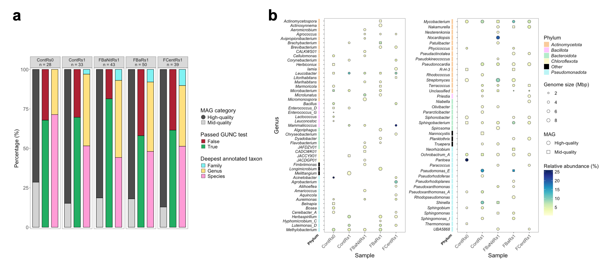{style="display: block; margin: 0 auto"}

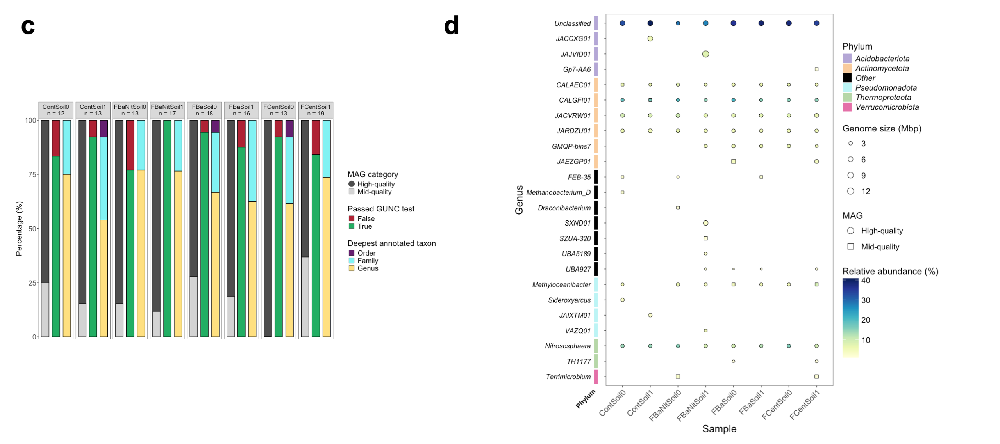{style="display: block; margin: 0 auto"}

> **Figure 4.** Metrics summaries of the MAGs built from **rice straw** (**a**) and **soil** (**c**) samples; the columns represent, in order, the proportion of: mid-quality and high-quality MAGs according to CheckM2 estimations; MAGs passing the GUNC test; and annotated MAGs at different taxonomical levels based on GTDB-Tk2. Presence/absence of MAGs annotated with GTDB-Tk2 in **rice straw** (**b**) **soil** (**d**) samples at **genus** level. Genome size, in Mbp, is indicated as the point size, while the color scale represents the relative abundance of each MAG per sample, and the point shape shows whether the displayed MAG is classified as high-quality or mid-quality (CheckM2). When MAGs with the same genus annotation were found in the same sample, the most complete one is depicted and their abundances are added up.

## Cross-referencing of quality metrics, taxonomical annotation, COG estimation and CAZy information for clustered MAGs.

{style="display: block; margin: 0 auto"}

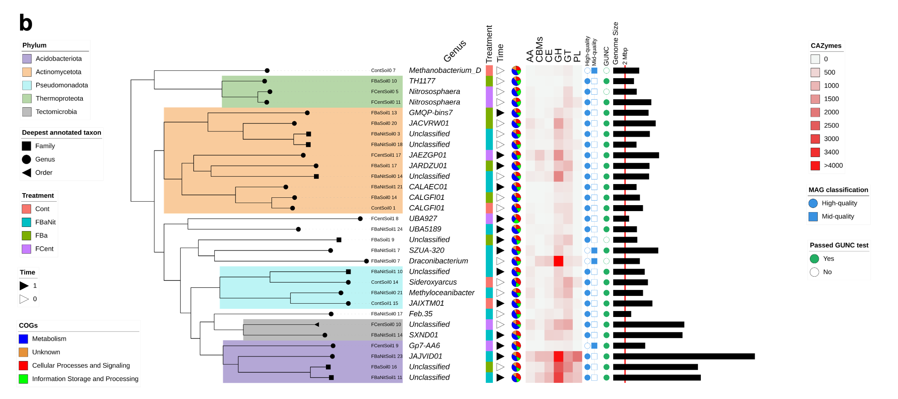{style="display: block; margin: 0 auto"}

> **Figure 5.** Recovered MAGs from **rice straw** (**a**) and **soil** (**b**) samples after clustering based on Average Nucleotide Identity (ANI). The visualization includes phylogenetic relationship among them (tree), specific highlighted phylum clades (colored sectors), deepest annotated taxon per bin (tips), genus classification (outer text), _Treatment_ (color strip), _Time_ information (black triangle binary), proportion of the main categories of Cluster of Orthologous Genes (COG) within each MAG (blue-orange-red-green pie chart), Carbon Active EnZyme (CAZy) class normalized abundance (red scaled heatmap), classification as either high-quality or mid-quality MAG based on checkM2 measurements (blue binary), GUNC test passing or not (green binary), and genome size in Mbp (outer black bars).The displayed MAGs are representatives from the generated clusters using ANI, and they were selected based on the following score: completeness – 0.5 x contamination. Conventions in CAZy heatmap: **GH** glycoside hydrolases, **GT** glyco-syltransferases, **PL** polysaccharide lyases, **CE** carbohydrate esterases, **CBMs** carbohydrate-binding modules, **AA** auxiliary activities.

## MAG clustering using CAZy information and β-glucosidase activity estimation

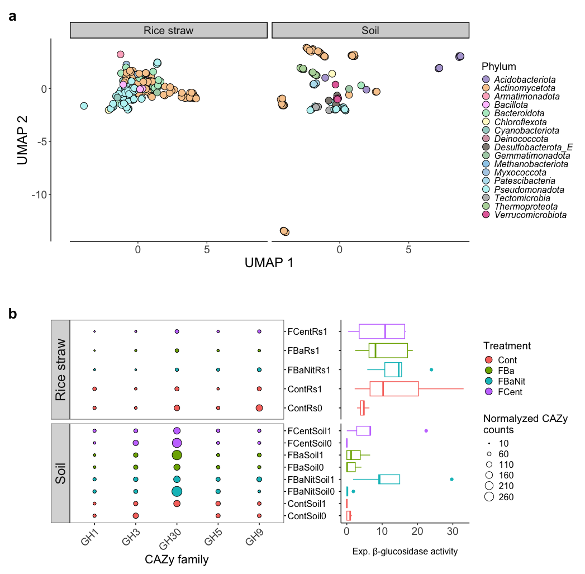{style="display: block; margin: 0 auto"}

> **Figure 6. a** Two-dimensional Uniform Manifold Approximation and Projection (UMAP) embedding of normalized CAZy enzymes counts per MAG (before clustering with FastANI) colored by phylum (GTDB-Tk2). All CAZy classes (GH, GT, PL, CE, AA and CBMs), along with all their families, were considered for clustering using default values (15 neighbors and Euclidean distance). **b** **Left:** bubble plot depicting normalized CAZy counts for β-glucosidase families (GH1, GH3, GH5 and GH9) per sample; **GH** glycoside hydrolases. **Right:** data distribution for experimental β-glucosidase activity quantified per sample. The point size on the bubble plot represents the maximum value of the counts of each CAZy family per sample, and _Treatment_ colors are shared by both the bubble plot and the boxplot.

## Abundance of CAZy-derived lignocellulose-degrading enzymes per MAG

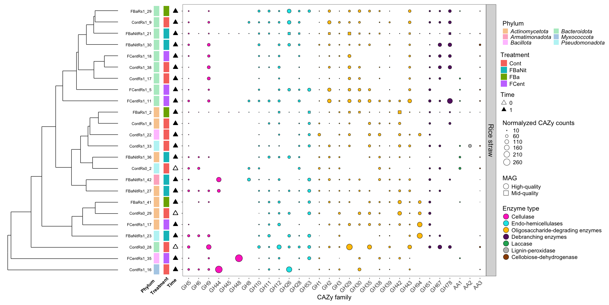{style="display: block; margin: 0 auto"}

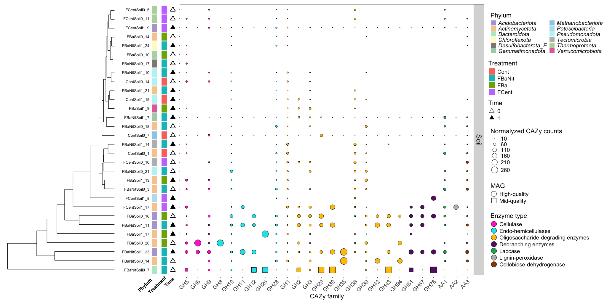{style="display: block; margin: 0 auto"}

> **Figure 7.** Bubble plot depicting the number of normalized counts for CAZy families associated with lignocellulose-degrading enzymes found in the MAGs recovered from **rice straw** (**top**) and **soil** (**bottom**) samples. Visualization includes (from left to right): MAG clustering using the CAZy counts of the selected families, _Treatment_ origin of the MAG, phylum information (GTDB-Tk2), _Time_ (0: initial, 1: after 30 days of Treatment). The classification as mid-quality or high-quality MAG (CheckM2) is represented by the shape in the bubble plot. The displayed MAGs are representatives from the generated clusters using ANI, and they were selected based on the following score: completeness – 0.5 x contamination. Additionally, for **rice straw**, MAGs were filtered considering only the ones with at least 3000 normalized counts in 5 or more CAZy families; complete information about normalized counts of these MAGs is found in **figure S4**.

# Supplementary Material

## Percentage of annotated reads with Kraken2/Bracken

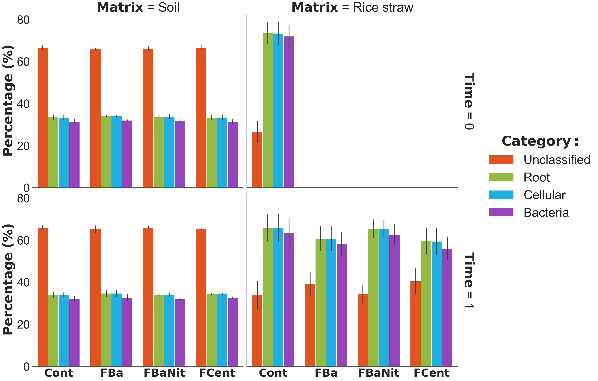{style="display: block; margin: 0 auto"}

> **Figure S1.** Percentage of annotated reads using Kraken2/Bracken segmented by matrix and time point. For rice straw at _Time_ 0 samples were taken from a bulk of material; this same bulk was subsampled with specific amounts of rice straw to start the experiments, and hence accounting with only 1 sample at _Time_ 0.

## Quality control with mock community

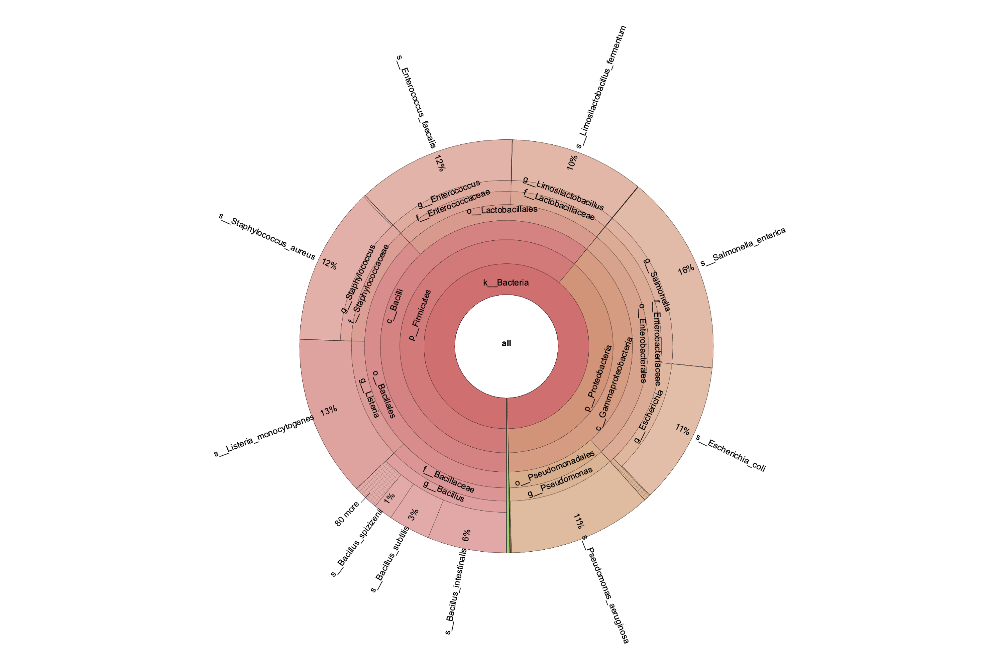{style="display: block; margin: 0 auto"}

> **Figure S2.** Krona plot displaying the taxonomical classification and relative abundance, performed with Kraken2 coupled to Bracken, of the reads belonging to the **mock community** sequenced as part of quality control for the DNA extraction process.

## GTDB taxonomy of rice straw MAGs

```{r table_rs, echo=FALSE}
library(knitr)
library(dplyr)
library(kableExtra)

final_df_rs <- read.csv("/Users/yepesgar/Downloads/project_analysis/compl_cont/comp_cont_rs.csv")

final_df_rs$Treatment <- rep("", nrow(final_df_rs))

# Words to search for
target_words <- c("Rs")

# Initialize a new column to store the preceding text

# Loop through each row
for (i in 1:nrow(final_df_rs)) {
  text <- final_df_rs$Bin[i]  # Get the text in the current row
  found_text <- NA  # Default value if no word is found
  
  # Loop through each target word
  for (word in target_words) {
    # Check if the target word is in the text
    if (grepl(word, text)) {
      # Split the text at the first occurrence of the target word and take the part before it
      found_text <- strsplit(text, paste0("\\s*", word, "\\s*"))[[1]][1]
      break  # Stop checking other words once the first match is found
    }
  }
  
  # Store the preceding text in the new column
  final_df_rs$Treatment[i] <- found_text
}

table_rs <- final_df_rs[,c('Bin', 'Treatment', 'sample','Time','MAG','Domain',
                           'Phylum', 'Class', 'Order',
                           'Family', 'Genus', 'Species')]

table_rs$sample[table_rs$sample == "rs"] <- 'Rice straw'
colnames(table_rs)[3] = "Matrix"

table_rs <- table_rs %>%
  arrange(Treatment, Bin)

table_rs$Treatment[table_rs$Treatment == "FBp"] <- 'FBa'
table_rs$Treatment[table_rs$Treatment == "FBpNit"] <- 'FBaNit'

table_rs %>% 
  kable %>%
  kable_styling(bootstrap_options = c("striped", "hover")) %>% 
 scroll_box(width = "800px", height = "500px")
```

## GTDB taxonomy of soil MAGs

```{r table_soil, echo=FALSE}
final_df_soil <- read.csv("/Users/yepesgar/Downloads/project_analysis/compl_cont/comp_cont_soil.csv")

final_df_soil$Treatment <- rep("", nrow(final_df_soil))

# Words to search for
target_words <- c("Soil")

# Initialize a new column to store the preceding text

# Loop through each row
for (i in 1:nrow(final_df_soil)) {
  text <- final_df_soil$Bin[i]  # Get the text in the current row
  found_text <- NA  # Default value if no word is found
  
  # Loop through each target word
  for (word in target_words) {
    # Check if the target word is in the text
    if (grepl(word, text)) {
      # Split the text at the first occurrence of the target word and take the part before it
      found_text <- strsplit(text, paste0("\\s*", word, "\\s*"))[[1]][1]
      break  # Stop checking other words once the first match is found
    }
  }
  
  # Store the preceding text in the new column
  final_df_soil$Treatment[i] <- found_text
}

table_soil <- final_df_soil[,c('Bin', 'Treatment', 'sample','Time','MAG','Domain',
                           'Phylum', 'Class', 'Order',
                           'Family', 'Genus', 'Species')]

table_soil$sample[table_soil$sample == "soil"] <- 'Soil'
colnames(table_soil)[3] = "Matrix"

table_soil <- table_soil %>%
  arrange(Treatment, Bin)

table_soil$Treatment[table_soil$Treatment == "FBp"] <- 'FBa'
table_soil$Treatment[table_soil$Treatment == "FBpNit"] <- 'FBaNit'

table_soil %>% 
  kable %>%
  kable_styling(bootstrap_options = c("striped", "hover")) %>% 
  scroll_box(width = "800px", height = "500px")
```

## Cluster of Orthologous Genes (COG) annotation

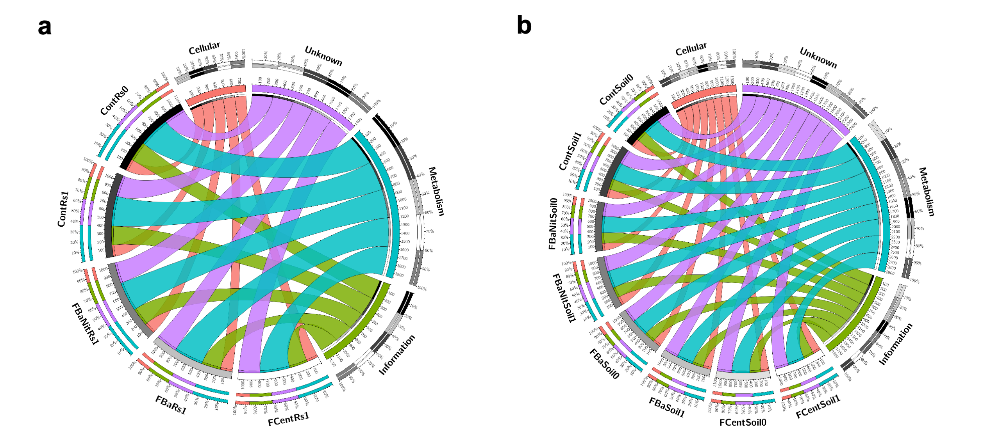{style="display: block; margin: 0 auto"}

> **Figure S3.** Circos plots showing the proportion of the 4 main categories (**Metabolism**; **Information** Storage and Processing; **Cellular** Processes and Signaling; and Protein Coding Sequences with **Unknown** function) of Clusters of Orthologs Genes (COGs) found within the MAGs recovered from **rice straw** (**a**) and **soil** (**b**) the samples. The inner ring accounts for the total number of COGs related to every sample or COG category; the outer ring depicts the relative abundance of COGs from each sample or COG category; the width of the ribbons linking any sample and a COG category depicts their relative abundance to each other. The number of counts per category was normalized using the total number of genes found per MAG.

## Cellulose-related CAZymes found within all MAGs in rice straw

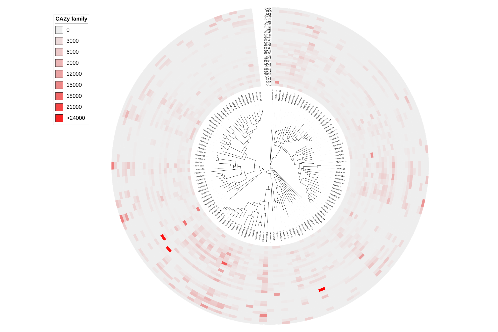{style="display: block; margin: 0 auto"}

> **Figure S4.** Clustered MAGs recovered from **rice straw** samples and their normalized counts for CAZy families associated with lignocellulose-degrading enzymes.The organization of the tree relies on the phylogenetic information retrieved from GTDB-Tk2. The displayed MAGs are representatives from the generated clusters using ANI, and they were selected based on the following score: completeness – 0.5 x contamination.

## Enzymatic activity of the different samples

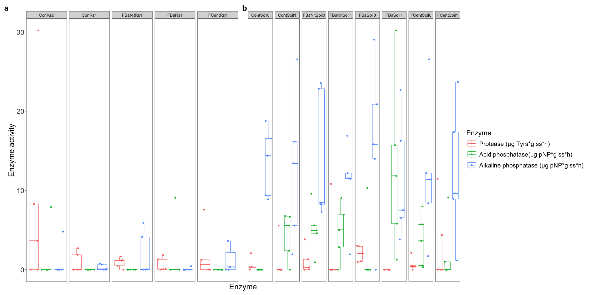{style="display: block; margin: 0 auto"}

> **Figure S5.** Experimental protease, acid and alkaline phosphatase activities of **rice straw** (**a**) and **soil** (**b**) samples. The enzymatic activity was measured according to the guidelines established by Alef & Nannipieri (1995).

## Physicochemical parameters of soil samples

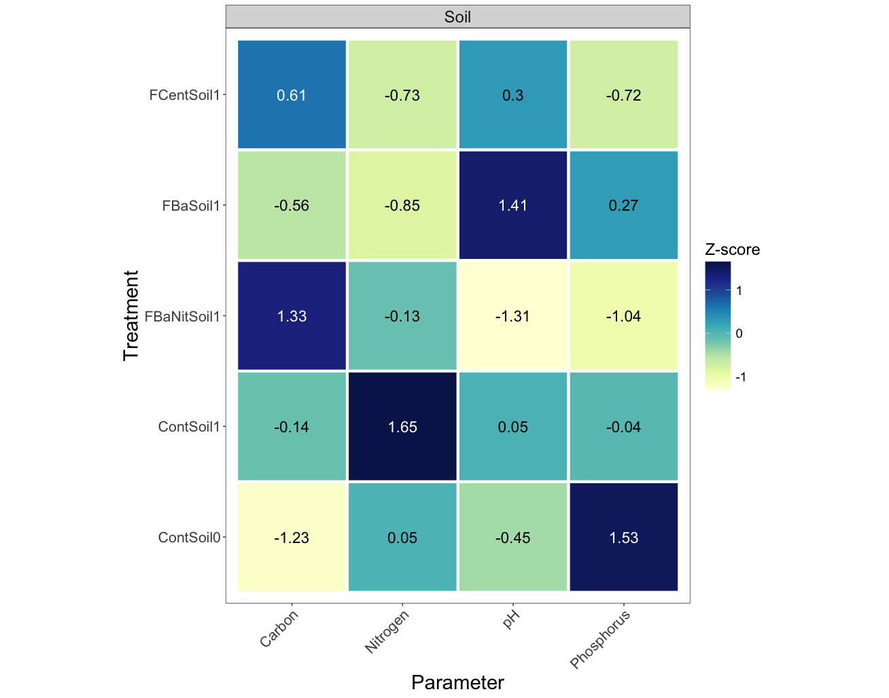{style="display: block; margin: 0 auto"}

> **Figure S6.** Experimental measures of physicochemical parameters in **soil** samples including total **Carbon**, total **Nitrogen**, **pH** and **phosphorus**. The data were normalized using z-score to adjust the raw values to the same scale; the displayed numbers represent the mean of the quantified parameter per sample.