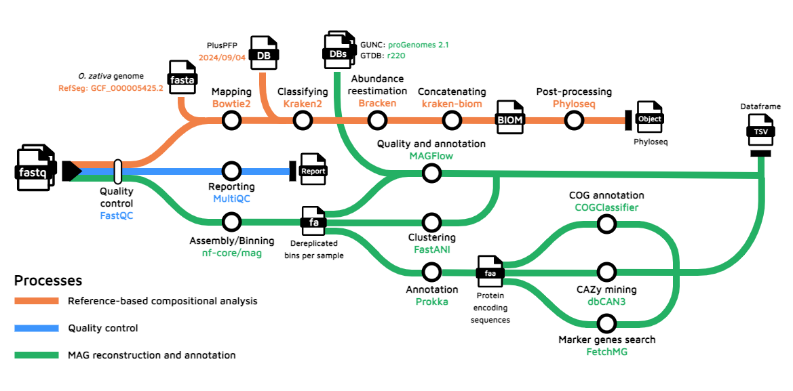
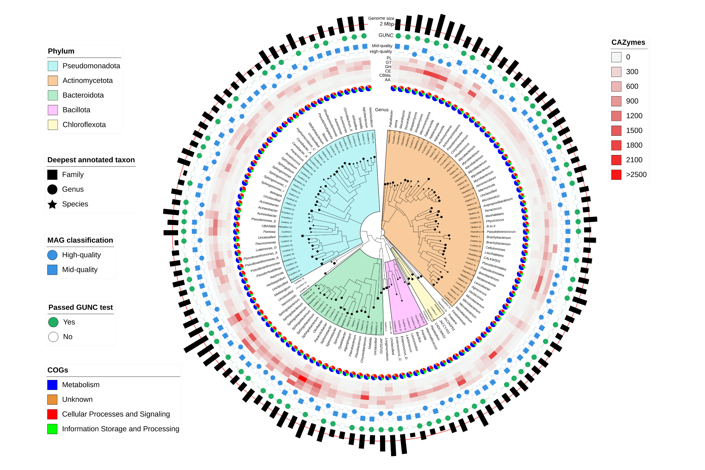
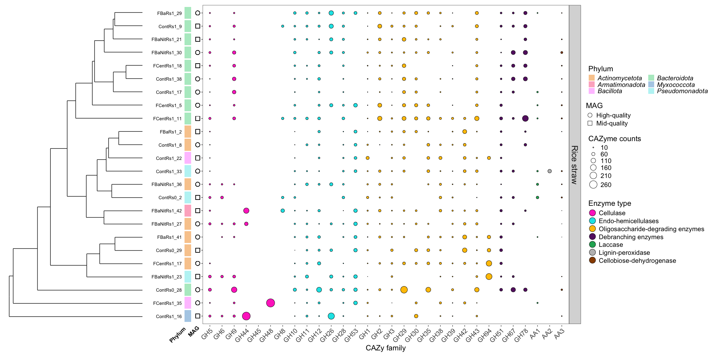
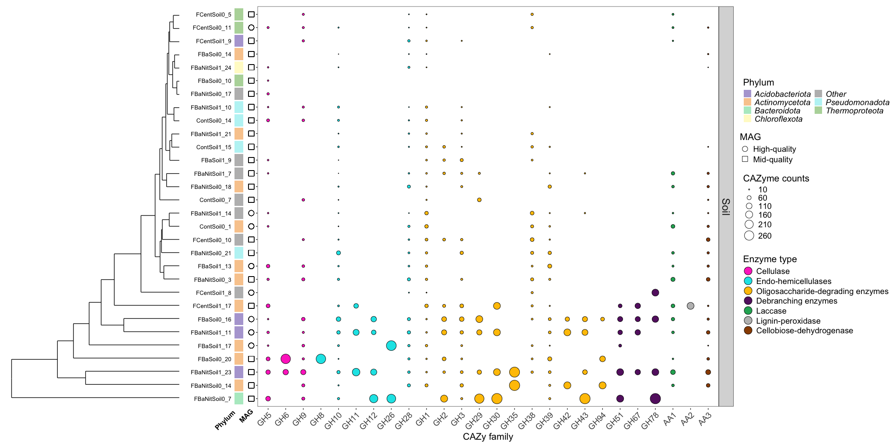
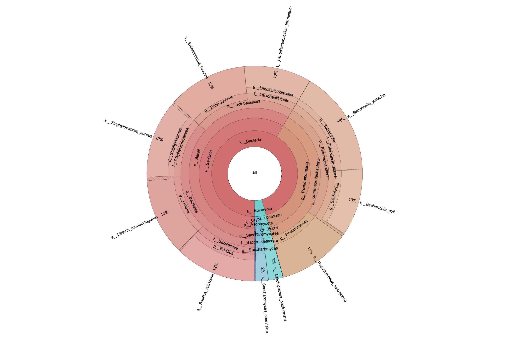
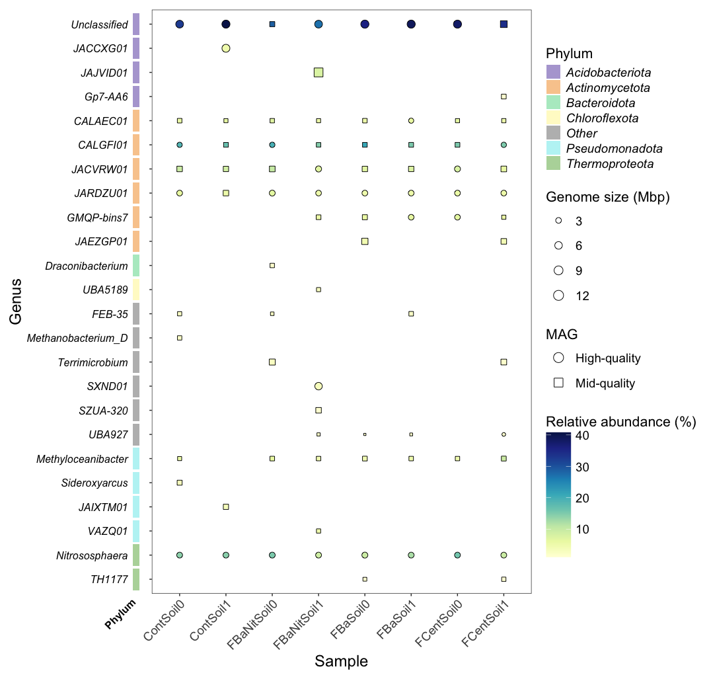
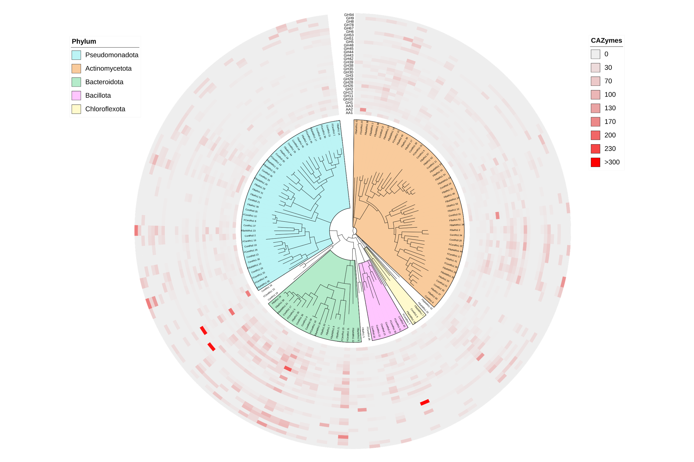

```{r setup, include=FALSE}
knitr::opts_chunk$set(echo = TRUE)
knitr::opts_chunk$set(warning = FALSE, message = FALSE) 
```

**Department of Biology**, University of Fribourg, Fribourg, Canton of Fribourg, 1700, Switzerland

**Swiss Institute of Bioinformatics**, Lausanne, Vaud, 1015, Switzerland

**Agricultural Microbiology Group**, Biotechnology Institute, Universidad Nacional de Colombia, A.A 14-490, Bogotá D.C., Colombia

**Department of Soil and Water Systems**, University of Idaho, 875 Perimeter Drive MS2340, Moscow, ID 83844-2340, United States of America

**Bioinformatics group**, Biotechnology Institute, Universidad Nacional de Colombia, A.A 14-490, Bogotá D.C., Colombia

Correspondence should be addressed to L.F (laurent.falquet@unifr.ch)

# Abstract

<p style='text-align: justify;'>**Background**
Rice is one of the top three crops that contribute 60% of the calories consumed by humans worldwide. Nonetheless, extensive rice harvesting yields more than 800 tons of rice straw (RS) per year globally, generating a byproduct that is often difficult for farmers to manage efficiently without burning it. As a result, millions of tons of carbon dioxide and greenhouse gases are released, causing issues such as respiratory problems, soil degradation and global warming. In this work, we explore the biological decomposition of RS through the application of microbial consortia from a metagenomics perspective.</p>

<p style='text-align: justify;'>**Results**
We applied different treatments to RS placed in a mulching setup during experiments carried out in Colombian rice fields, using various combinations of a Trichoderma-based commercial product, the bacterial strain Bacillus altitudinis, organic nitrogen, and a mixture of potassium-reducing organic acids. Before inoculation and after 30 days of treatment, we characterized the microbial community on the surface of the material and from the bulk soil by performing a reference-based compositional analysis, and reconstructing and functionally annotating Metagenome-Assembled Genomes (MAGs). High-quality MAGs with great potential to decompose RS, represented by the extensive number of carbohydrate-active enzymes, were recovered. Soil MAGs taxonomic classification indicates that they may represent potential novel microbial taxa, while the main part of the RS MAGs with superior lignocellulose-degrading capacity were affiliated under Actinomycetota and Bacteroidota phyla. Moreover, the biotransformation capacity of the MAGs was indirectly verified by quantifying β-glucosidase activity of the samples they were extracted from, and an improvement on the action of this enzyme was detected, suggesting cellulose degradation by the native microbiota possibly triggered by Trichoderma sp.</p>

<p style='text-align: justify;'>**Conclusions**
This contribution underscores the possibility of promoting RS degradation through biological strategies by the activation of native microorganisms. Further, the newly unveiled MAGs with high RS-degrading potential provide a valuable resource for exploring the functional potential of previously uncharacterized microbial diversity in Colombian agricultural ecosystems, including microorganisms that have not been previously reported as remarkable lignocellulose decomposers.<p style='text-align: justify;'>
</p>

## Graphical Abstract

{style="display: block; margin: 0 auto"}

> 🚀   **Please click on the images to enlarge them.**

# Methodology

## Reference-based compositional analysis

<p style='text-align: justify;'>We used Kraken2/Bracken to perform taxonomic assignment of the raw sequences. The procedure included the remotion of reads mapping the rice genome ([O. zativa, RefSeq accession number: GCF_000005425.2](https://www.ncbi.nlm.nih.gov/datasets/genome/GCF_000005425.2/)). The workflow is proposed by Lu et al. (2022), wrapped by Nextflow.</p>

<p style='text-align: justify;'>The analysis of the raw counts was developed by wrapping the output as a Phyloseq object to estimate effect of treatments and time over relative abundance, α-Diversity, β-Diversity and differentially abundant taxa.</p>

## MAG recovery

<p style='text-align: justify;'>nf-core/mag was implemented to build and annotate the MAGs from the raw sequences. A co-assembly/co-binning strategy was chosen as an attempt to improve the quality and resolution of the MAGs. MEGAHIT was used for the assembly, while MaxBin2 and MetaBAT2 were the selected tools for binning. A de-replication and refinement step was carried by enabling DASTool within the workflow. For the downstream analysis, the curated MAGs were analyzed with MAGFlow/BIgMAG, that includes quality-measuring tools such as CheckM2, BUSCO, GUNC and QUAST, as well as the taxonomic annotator GTDB-Tk2 relying on database r220. The presence of Carbohydrate-Active enZYmes [(CAZymes)](https://www.cazy.org/) was studied through dbCAN3, whilst Cluster of Orthologous Genes (COGs) were detected by COGclassifier. The selection of the MAGs was carried out using the criteria: completeness above 50% and contamination below 10%. In addition, MAGS belonging to either rice straw or soil with average differences <5% ANI were clustered using FastANI. For data visualization, Circos, iTOL and ggplot2 packages were used.</p>

{style="display: block; margin: 0 auto"}

> **Fig. 1.** Bioinformatics workflow followed to evaluate sequence quality, perform reference-based compositional analysis, and MAG recovery.

# Results

## MAGs and CAZyme information

{style="display: block; margin: 0 auto"}

> **Fig. 2. a** Two-dimensional Uniform Manifold Approximation and Projection (UMAP) embedding of normalized CAZy enzymes counts per MAG (before clustering with FastANI) colored by phylum (GTDB-Tk2). All CAZy classes (GH, GT, PL, CE, AA and CBMs), along with all their families, were considered for clustering using default values (15 neighbors and Euclidean distance). **b** Taxonomic classification (at the domain and phylum levels), quality (CheckM2), and identification as species or not of the clustered MAGs from the RS and soil metagenomes. The exact order of the missing phylum labels within the **b** plot can be read from the legend on **a**.

{style="display: block; margin: 0 auto"}

> **Fig. 3.** Recovered MAGs from **RS** samples after clustering based on Average Nucleotide Identity (ANI). The visualization includes phylogenetic relationship among them (tree), specific highlighted phylum clades (colored sectors), genus classification (outer text), proportion of the main categories of Cluster of Orthologous Genes (COG) within each MAG (blue-orange-red-green pie chart), Carbon Active EnZyme (CAZyme) class normalized abundance (red scaled heatmap), classification as either high-quality or mid-quality MAG based on checkM2 measurements (blue binary), GUNC test passing (green binary), and genome size in Mbp (outer black bars).The displayed MAGs are representatives from the generated clusters using ANI, and they were selected based on the score: completeness – 0.5 x contamination. Conventions in CAZyme heatmap: GH glycoside hydrolases, GT glyco-syltransferases, PL polysaccharide lyases, CE carbohydrate esterases, CBMs carbohydrate-binding modules, AA auxiliary activities.

{style="display: block; margin: 0 auto"}

> **Fig. 4.** Recovered MAGs from **soil** samples after clustering based on Average Nucleotide Identity (ANI). See **Fig. 3** for feature explanation.

{style="display: block; margin: 0 auto"}

> **Fig. 5.** Bubble plot depicting the number of normalized counts for CAZyme families associated with lignocellulose-degrading enzymes found in the MAGs recovered from **RS** samples. Visualization includes: MAG clustering based on normalized CAZyme counts of the selected families, and phylum information (GTDB-Tk2). The classification as MQ MAG or HQ MAG (CheckM2) is designated by the shape in the bubble plot. The displayed MAGs are representatives from the generated clusters using ANI, and they were selected based on the score: completeness – 0.5 x contamination. Displayed RS MAGs contain at least 30 normalized counts in 5 or more CAZyme families; complete information about normalized CAZyme counts in RS MAGs is found in **Fig. S15**.

{style="display: block; margin: 0 auto"}

> **Fig. 6.** Bubble plot depicting the number of normalized counts for CAZyme families associated with lignocellulose-degrading enzymes found in the clustered MAGs recovered from **soil** samples. See **Fig. 5** for feature explanation. All soil MAGs are displayed.

{style="display: block; margin: 0 auto"}

> **Fig. 7.** Boxplot showing the distribution and abundance of normalized counts for CAZyme families associated with lignocellulose-degrading enzymes found in the MAGs recovered from RS and soil samples.

## β‑Glucosidase activity

{style="display: block; margin: 0 auto"}

> **Fig. 8**. **Left:** bubble plot depicting normalized CAZyme counts for β-glucosidase families (GH1, GH3, GH5 and GH9) per sample; GH glycoside hydrolases. **Right:** data distribution of experimental β-glucosidase activity per sample. The displayed normalized CAZyme values represent the maximum count in a given MAG of each GH family within the sample; treatment colors are shared by both the bubble plot and the boxplot.

# Supplementary Figures

## Field experiments

{style="display: block; margin: 0 auto"}

> **Fig. S1**. Field diagram of plots and yard distribution, illustrating yard sizing and color plotting distribution on the field. Green dot lines indicate rice furrows without treatment used as a natural barrier between plot treatments. Blank spots represent spaces without treatments due to field irregular terrain impeding a treatment application. Arrow indicates magnetic north.

{style="display: block; margin: 0 auto"}

{style="display: block; margin: 0 auto"}

> **Fig. S2**. Illustration of sampling points for soil and straw for physicochemical and enzymatic analysis on field. **A** shows the distribution of soil sampling points within each plot; **B** depicts the distribution of rice straw sampling points within each plot; **C** displays a field picture showing the marks used for the replicas and color code per treatment: pink represents Cont plots, blue FBa plots, yellow FBaNit plots, and violet FCent plots; **D** presents RS manual collection; **E** exemplifies a tube probe for soil sampling; and **F**,**G** exhibit soil sample disposal in marked Ziploc® bags.

## Soil parameters

{style="display: block; margin: 0 auto"}

> **Fig. S3**. Experimental measures of physicochemical parameters in **soil** samples including total carbon, total nitrogen, pH and phosphorus. The data were normalized using the Min-Max method to adjust the raw values to the same scale; the displayed numbers represent the mean of the quantified parameter per sample.

## Enzymatic activity

{style="display: block; margin: 0 auto"}

> **Fig. S4**. Experimental protease, acid, and alkaline phosphatase activities of **RS** (**a**) and **soil** (**b**) samples. The enzymatic activity was measured according to the guidelines established by Alef & Nannipieri (1995).

## Reference-based analysis

{style="display: block; margin: 0 auto"}

> **Fig. S5**. Screenshot of a Krona plot displaying the taxonomic classification and relative abundance, performed with Kraken2 coupled to Bracken, of the reads belonging to the mock community sequenced as part of quality control for the DNA extraction process.

{style="display: block; margin: 0 auto"}

> **Fig. S6**. Taxonomic profiling of the sequences using Kraken2 coupled to Bracken: **a** Relative domain abundance per matrix source, merging all the replicates per sample. **b** α-Diversity, colored by treatment, measured through Shannon and Inverse Simpson indices. **c** Sample ordination through Principal Coordinate Analysis (PCoA) using a Bray-Curtis dissimilarity matrix as input. The ellipses represent 95% confidence regions around the centroids of each group calculated by the assumption of multivariate t-distribution. **d** Two-dimensional Uniform Manifold Approximation and Projection (UMAP) embedding of β-Diversity estimation of the samples based on the Aitchison distance. **e** Compositional variability of the samples, measured as distance to the centroid in a multivariate space computed with the Aitchison distance among samples. ANOVA analysis results show no significant differences in terms of group dispersion. **f** Proportion of the variance explained by the factors Time and Treatment, segmented by matrix source, in Permutational Analysis of Variance (PERMANOVA) implemented according to different distance/dissimilarity metrics; the significance of each factor is determined by the symbol color. **g** Selected differentially abundant genera in RS samples based on Analysis of Compositions of Microbiomes with Bias Correction 2 (ANCOM-BC2). **Left:** log<sub>2</sub>FC of treatments to *Cont0*, and **Right:** Boxplots of selected genera abundance (counts) in log<sub>10</sub> scale. All displayed genera exhibit p-value < 0.05 adjusted with Holm–Bonferroni method for multiple comparisons. *Cont0* and *Cont1* in RS comparisons indicate Cont samples at time 0 and 1, respectively. Differences throughout time for all treatments against Cont samples at time 0 are shown. All the analysis from **b** to **f** were carried out only with Bacteria data and normalized counts as Counts per million (CPM). The treatment colors are transversal to plots **b**, **c**, **d**, **e**, **f** and **g**. ANCOM-BC2 was implemented with agglomerated data at genus level, and with the most abundant taxa (> 0.5%).

{style="display: block; margin: 0 auto"}

> **Fig. S7**. Percentage of annotated reads using Kraken2/Bracken segmented by matrix and time point. For RS at time 0 samples were taken from a bulk of material; this same bulk was subsampled with specific amounts of rice straw to start the experiments, and hence accounting with only 1 sample at time 0.

{style="display: block; margin: 0 auto"}

> **Fig. S8**. Relative **phylum** (**a**, **c**) and **genus** (**b**, **d**) abundance of agglomerated data (Bacteria, top; Eukaryota, bottom). Displaying abundance values that belong to the portion of the reads annotated in each domain (see **Fig. S6a** and **Fig. S7**). Replicates were merged, and the panels are split by matrix source. On phylum plots, only phyla with relative abundance above 0.5% are displayed, whilst on genus plots genera above 3% and 2% are depicted for Bacteria and Eukaryota, respectively.

{style="display: block; margin: 0 auto"}

> **Fig. S9**. Relative genus abundance of agglomerated **RS** data with panels split by treatment. Only genera with relative abundance above 3% are displayed.

## MAG reconstruction

{style="display: block; margin: 0 auto"}

> **Fig. S10**. Metrics summaries of the MAGs built from **RS** (**a**) and **soil** (**b**) samples; the columns represent, in order, the proportion of: mid-quality and high-quality MAGs according to CheckM2 estimations; MAGs passing the GUNC test; and annotated MAGs at different taxonomic levels based on GTDB-Tk2.

{style="display: block; margin: 0 auto"}

> **Fig. S11**. Presence/absence of MAGs annotated with GTDB-Tk2 in **RS** samples at genus level. Genome size, in Mbp, is indicated as the point size, while the color scale represents the relative abundance of each MAG per sample, and the point shape shows whether the displayed MAG is classified as high-quality or mid-quality (CheckM2). When MAGs with the same genus annotation were found in the same sample, the most complete one is depicted and their abundances are added up.

{style="display: block; margin: 0 auto"}

> **Fig. S12**. Presence/absence of MAGs annotated with GTDB-Tk2 in **soil** samples at genus level. Genome size, in Mbp, is indicated as the point size, while the color scale represents the relative abundance of each MAG per sample, and the point shape shows whether the displayed MAG is classified as high-quality or mid-quality (CheckM2). When MAGs with the same genus annotation were found in the same sample, the most complete one is depicted and their abundances are added up.

## MAGs and CAZyme information

{style="display: block; margin: 0 auto"}

{style="display: block; margin: 0 auto"}

> **Fig. S13**. Circos plots showing the proportion of the 4 main categories (Metabolism; Information Storage and Processing; Cellular Processes and Signaling; and Protein Coding Sequences with Unknown function) of Clusters of Orthologous Genes (COGs) found within the MAGs recovered from **RS** (**top**) and **soil** (**bottom**) the samples. The inner ring accounts for the total number of COGs related to every sample or COG category; the outer ring depicts the relative abundance of COGs from each sample or COG category; the width of the ribbons linking any sample and a COG category depicts their relative abundance to each other. The number of counts per category was normalized using the total number of genes found per MAG.

{style="display: block; margin: 0 auto"}

> **Fig. S14**. Two-dimensional Uniform Manifold Approximation and Projection (UMAP) embedding of normalized CAZy enzymes counts per MAG (before clustering with FastANI) colored by treatment and shape by the time in which the MAGs were recovered.

{style="display: block; margin: 0 auto"}

> **Fig. S15**. Clustered MAGs recovered from **RS** samples and their normalized counts for CAZy families associated with lignocellulose-degrading enzymes.The organization of the tree relies on the phylogenetic information retrieved from GTDB-Tk2. The displayed MAGs are representatives from the generated clusters using ANI, and they were selected based on the following score: completeness – 0.5 x contamination.

# Supplementary Tables

## GTDB taxonomy of RS MAGs

```{r table_rs, echo=FALSE}
library(knitr)
library(dplyr)
library(kableExtra)

final_df_rs <- read.csv("/Users/yepesgar/Downloads/project_analysis/compl_cont/comp_cont_rs.csv")

final_df_rs$Treatment <- rep("", nrow(final_df_rs))

# Words to search for
target_words <- c("Rs")

# Initialize a new column to store the preceding text

# Loop through each row
for (i in 1:nrow(final_df_rs)) {
  text <- final_df_rs$Bin[i]  # Get the text in the current row
  found_text <- NA  # Default value if no word is found
  
  # Loop through each target word
  for (word in target_words) {
    # Check if the target word is in the text
    if (grepl(word, text)) {
      # Split the text at the first occurrence of the target word and take the part before it
      found_text <- strsplit(text, paste0("\\s*", word, "\\s*"))[[1]][1]
      break  # Stop checking other words once the first match is found
    }
  }
  
  # Store the preceding text in the new column
  final_df_rs$Treatment[i] <- found_text
}

table_rs <- final_df_rs[,c('Bin', 'Treatment', 'sample','Time','MAG','Domain',
                           'Phylum', 'Class', 'Order',
                           'Family', 'Genus', 'Species')]

table_rs$sample[table_rs$sample == "rs"] <- 'Rice straw'
colnames(table_rs)[3] = "Matrix"

table_rs <- table_rs %>%
  arrange(Treatment, Bin)

table_rs$Treatment[table_rs$Treatment == "FBp"] <- 'FBa'
table_rs$Treatment[table_rs$Treatment == "FBpNit"] <- 'FBaNit'

table_rs %>% 
  kable %>%
  kable_styling(bootstrap_options = c("striped", "hover")) %>% 
 scroll_box(width = "800px", height = "500px")
```

## GTDB taxonomy of soil MAGs

```{r table_soil, echo=FALSE}
final_df_soil <- read.csv("/Users/yepesgar/Downloads/project_analysis/compl_cont/comp_cont_soil.csv")

final_df_soil$Treatment <- rep("", nrow(final_df_soil))

# Words to search for
target_words <- c("Soil")

# Initialize a new column to store the preceding text

# Loop through each row
for (i in 1:nrow(final_df_soil)) {
  text <- final_df_soil$Bin[i]  # Get the text in the current row
  found_text <- NA  # Default value if no word is found
  
  # Loop through each target word
  for (word in target_words) {
    # Check if the target word is in the text
    if (grepl(word, text)) {
      # Split the text at the first occurrence of the target word and take the part before it
      found_text <- strsplit(text, paste0("\\s*", word, "\\s*"))[[1]][1]
      break  # Stop checking other words once the first match is found
    }
  }
  
  # Store the preceding text in the new column
  final_df_soil$Treatment[i] <- found_text
}

table_soil <- final_df_soil[,c('Bin', 'Treatment', 'sample','Time','MAG','Domain',
                           'Phylum', 'Class', 'Order',
                           'Family', 'Genus', 'Species')]

table_soil$sample[table_soil$sample == "soil"] <- 'Soil'
colnames(table_soil)[3] = "Matrix"

table_soil <- table_soil %>%
  arrange(Treatment, Bin)

table_soil$Treatment[table_soil$Treatment == "FBp"] <- 'FBa'
table_soil$Treatment[table_soil$Treatment == "FBpNit"] <- 'FBaNit'

table_soil %>% 
  kable %>%
  kable_styling(bootstrap_options = c("striped", "hover")) %>% 
  scroll_box(width = "800px", height = "500px")
```