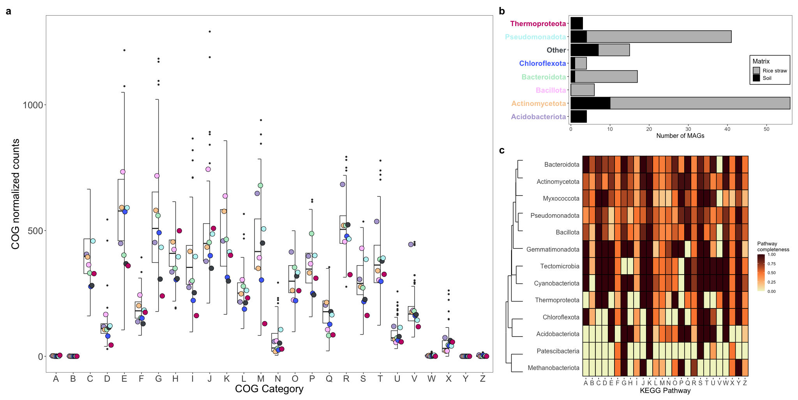
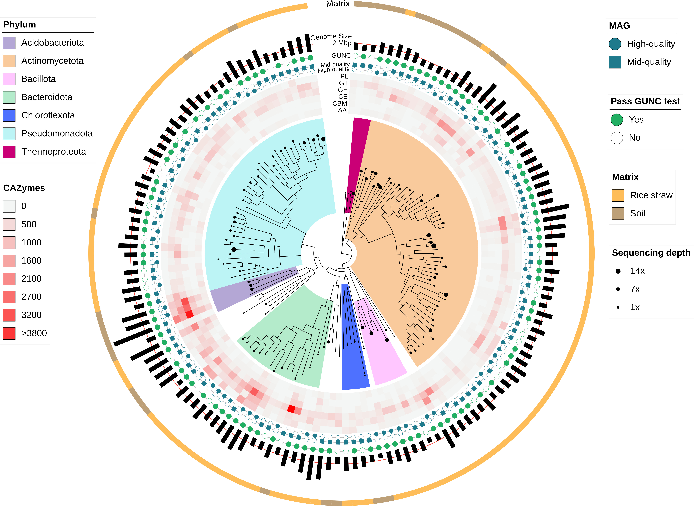
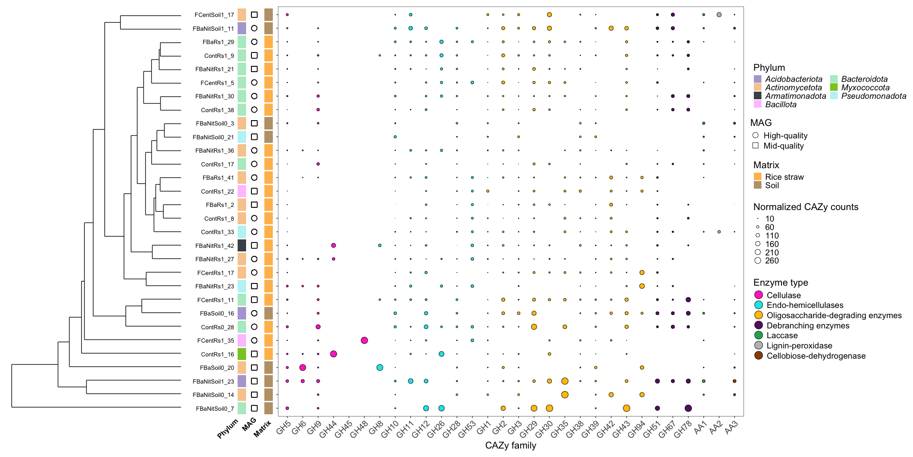

```{r setup, include=FALSE}
knitr::opts_chunk$set(echo = TRUE)
knitr::opts_chunk$set(warning = FALSE, message = FALSE, cache = TRUE)
```


**Department of Biology**, University of Fribourg, Fribourg, Canton of Fribourg, 1700, Switzerland

**Swiss Institute of Bioinformatics**, Lausanne, Vaud, 1015, Switzerland

**Agricultural Microbiology Group**, Biotechnology Institute, Universidad Nacional de Colombia, A.A 14-490, Bogotá D.C., Colombia

**Department of Soil and Water Systems**, University of Idaho, 875 Perimeter Drive MS2340, Moscow, ID 83844-2340, United States of America

**Bioinformatics group**, Biotechnology Institute, Universidad Nacional de Colombia, A.A 14-490, Bogotá D.C., Colombia

Correspondence should be addressed to L.F (laurent.falquet@unifr.ch)

Link to the publication: [https://doi.org/10.1038/s41597-025-06113-2](https://doi.org/10.1038/s41597-025-06113-2)

# Abstract

<p style='text-align: justify;'>Extensive rice harvesting yields more than 800 million tons of rice straw (RS) per year globally, generating a byproduct that is often difficult for farmers to manage efficiently without burning it. In the quest for enhanced RS degradation systems, we recovered 155 Metagenome-Assembled Genomes (MAGs) from experiments aiming at decomposing RS. Such assays included the application of a Bacillus strain, a Trichoderma-based commercial product, organic and inorganic compounds in different combinations during a solid-state fermentation in Colombian rice fields. The set of MAGs comprises 30 MAGs from bulk soil and 125 MAGs from RS surface, for which taxonomic classification indicates that 65% of them may constitute novel taxa. Furthermore, functional analysis through different approaches suggests the presence of both mid-quality and high-quality MAGs with potential to biotransform RS within this dataset. Finally, these MAGs represent a valuable resource for exploring uncharacterized microbial diversity in Colombian agricultural ecosystems.</p>

## Graphical Abstract

{style="display: block; margin: 0 auto"}

# Results

## MAG reconstruction and annotation

```{r alluvial_umap, echo=TRUE}
library(dplyr)
library(tidyr)
library(umap)
library(vegan)
library(ape)
library(stringr)
library(ggplot2)
library(patchwork)
library(ggalluvial)
library(gghalves)
library(caret)
library(reshape2)
library(phyloseq)

#Alluvial plot

final_df_rs <- read.csv("data/comp_cont_rs.csv")
clustered <- read.csv("data/clustered_mags_rs_list.tsv")
clustered_bins <- clustered$Bin
clustered_mags_rs <- final_df_rs[final_df_rs$Bin %in% clustered_bins,]
clustered_mags_rs <- clustered_mags_rs[,c('Bin','MAG', 'Domain','Phylum', 'taxa_rank')]
clustered_mags_rs$Matrix <- rep("Rice straw", nrow(clustered_mags_rs))

final_df_soil <- read.csv("data/comp_cont_soil.csv")
clustered <- read.csv("data/clustered_mags_soil_list.tsv")
clustered_bins <- clustered$Bin
clustered_mags_soil <- final_df_soil[final_df_soil$Bin %in% clustered_bins,]
clustered_mags_soil <- clustered_mags_soil[,c('Bin','MAG', 'Domain','Phylum', 'taxa_rank')]
clustered_mags_soil$Matrix <- rep("Soil", nrow(clustered_mags_soil))

merged_clustered_mags <- rbind(clustered_mags_soil, clustered_mags_rs)

merged_clustered_mags <- merged_clustered_mags %>%
  mutate(Species = ifelse(taxa_rank == "Species", "Yes", "No"))

all_phylum <- unique(merged_clustered_mags$Phylum)
select_phylum <- c("Actinomycetota", "Bacteroidota", "Acidobacteriota", "Pseudomonadota",
                   "Chloroflexota", "Thermoproteota", "Bacillota")

mags_2_remove <- c("ContRs0_25", "ContRs0_27", "ContRs0_29", "ContRs0_2",
                   "FBpNitRs1_21", "FBpRs1_20", "FCentRs1_14", "FCentRs1_18",
                   "FCentRs1_1")

merged_clustered_mags$Phylum <- ifelse(merged_clustered_mags$Phylum %in% select_phylum, merged_clustered_mags$Phylum, "Other")

merged_clustered_mags <- subset(merged_clustered_mags, !(Bin %in% mags_2_remove))

compacted_clustered_mags <- merged_clustered_mags %>%
  count(MAG, Domain, Phylum, Matrix, Species, name = "Count")

hidden_labels <- c("Soil", "Rice straw", "Bacteria", "Archaea","",
                   "","","","","",
                   "","",
                   "Mid-quality", "High-quality",
                   "Yes", "No")
alluvial_plot <- ggplot(data = compacted_clustered_mags,
                        aes(axis1 = Matrix, axis2 = Domain, axis3 = Phylum, axis4 = MAG, axis5 = Species,
                            y = Count, label = Phylum)) +
  scale_x_discrete(limits = c("Matrix", "Domain", "Phylum", "Quality", "Species"),
                   expand = c(0.05,0.05)) +
  geom_alluvium(aes(fill = Matrix), color = "black") +
  geom_stratum(color = "black") +
  ggfittext::geom_fit_text(stat = "stratum", width = 1/3, min.size = 4)+
  geom_text(
    stat = "stratum",
    aes(label = ifelse(after_stat(x) == 3, "", hidden_labels)),  # Hide text for second axis
    size = 3.0
  ) +
  theme_bw()+
  theme(axis.text.x = element_text(angle = 45, vjust = 1,
                                   size = 14, hjust = 1),
        axis.text.y = element_text(size = 14),
        axis.title = element_text(size = 16),
        legend.position = "none",
        panel.grid.major = element_blank(),
        panel.grid.minor = element_blank())+
  labs(y="Number of MAGs")+
  scale_fill_manual(values=c("#ffbd59","#bda077"))

clustered_rs <- read.csv("data/clustered_mags_rs_list.tsv")
clustered_soil <- read.csv("data/clustered_mags_soil_list.tsv")

clustered <- rbind(clustered_rs,clustered_soil)
clustered_bins <- clustered$Bin
clustered_bins <-  clustered_bins[!(clustered_bins %in% mags_2_remove)]

cazy_soil <- read.csv("data/CAZy_tax_soil.csv")
cazy_rs <- read.csv("data/CAZy_tax_rs.csv")

median_fetchmg_df_soil = read.csv("data/fetchmg_median_soil.csv")
median_fetchmg_df_rs = read.csv("data/fetchmg_median_rs.csv")

select_phylum <- c("Actinomycetota", "Bacteroidota", "Acidobacteriota", "Pseudomonadota",
                   "Chloroflexota", "Thermoproteota", "Bacillota")

cazy <- rbind(cazy_soil, cazy_rs)

median_fetchmg_df <- rbind(median_fetchmg_df_soil, median_fetchmg_df_rs)

cazy_4_umap <- data.frame(cazy$bin,cazy$sample, cazy$Family_x, cazy$Class_x, cazy$Phylum)

cross_tab_umap <- as.matrix(table(cazy_4_umap$cazy.bin, cazy_4_umap$cazy.Family_x))
cross_tab_umap_df <- as.data.frame(cross_tab_umap)

colnames(cross_tab_umap_df)[1] ="bin"
colnames(cross_tab_umap_df)[2] ="module"
colnames(cross_tab_umap_df)[3] ="counts"
colnames(median_fetchmg_df)[2] ="median"

taxa_data <- data.frame(cazy$bin,cazy$Phylum)
colnames(taxa_data)[1] = "bin"
colnames(taxa_data)[2] = "Phylum"

taxa_data_unique <- taxa_data %>%
  distinct(bin, .keep_all = TRUE)

cross_tab_umap_df$sample <- sub("_.*", "", cross_tab_umap_df$bin)

total_sample_df <- cross_tab_umap_df %>%
  group_by(sample, module) %>%
  summarise(total_count = sum(counts), .groups = 'drop') 

total_sample_df <- as.data.frame(total_sample_df)

df_merged <- cross_tab_umap_df %>%
  inner_join(total_sample_df, by = c("sample", "module")) %>%
  inner_join(median_fetchmg_df, by = "sample")

df_result <- df_merged %>%
  mutate(Normalized_CAZyme_Count = (counts / total_count) / median * 10^4) %>%
  select(sample, bin, module, Normalized_CAZyme_Count)

df_result <- na.omit(df_result)

df_result <- df_result[df_result$bin %in% clustered_bins,]

df_wide_umap <- df_result %>%
  pivot_wider(names_from = module, values_from = Normalized_CAZyme_Count)

df_wide_umap[is.na(df_wide_umap)] <- 0

df_wide_umap$treatment <- str_extract(df_wide_umap$bin, "^[^_]*(?=Soil|Rs)")
df_wide_umap$matrix <- str_extract(df_wide_umap$bin, "Soil|Rs")
df_wide_umap$time <- str_extract(df_wide_umap$bin, "\\d")
df_wide_umap <- df_wide_umap %>%
  left_join(taxa_data_unique, by = "bin")

phylum <- df_wide_umap$Phylum
time <- df_wide_umap$time
matrix <- df_wide_umap$matrix
treatments <- df_wide_umap$treatment
sample_names <- df_wide_umap$sample

df_wide_umap <- df_wide_umap[,-1]
df_wide_umap <- df_wide_umap[,-1]
df_wide_umap <- df_wide_umap[1:(length(df_wide_umap)-1)]
df_wide_umap <- df_wide_umap[1:(length(df_wide_umap)-1)]
df_wide_umap <- df_wide_umap[1:(length(df_wide_umap)-1)]
df_wide_umap <- df_wide_umap[1:(length(df_wide_umap)-1)]

df_wide_umap_mx <- as.matrix(df_wide_umap)

umap_result <- umap(df_wide_umap_mx)
umap_df <- as.data.frame(umap_result$layout)
colnames(umap_df) <- c("UMAP1", "UMAP2")  # Rename columns for clarity

umap_df$Phylum <- phylum

umap_df$Phylum <- ifelse(umap_df$Phylum %in% select_phylum, umap_df$Phylum, "Other")

phylum_colors <- c("#b4a7d6", "#f9cb9c", "#ffc6ff","#b4ebca","#4E71FF", "#495057",
                   "#bcf4f5","#c90076")

df_tax_rs <- cazy_rs[ , c('bin','Phylum', 'Class_y', 'Order', 'Family_y',
                          'Genus', 'Species')]

df_tax_rs <- df_tax_rs %>%
  distinct()

df_tax_soil <- cazy_soil[ , c('bin','Phylum', 'Class_y', 'Order', 'Family_y',
                              'Genus', 'Species')]
df_tax_soil <- df_tax_soil %>%
  distinct()

df_tax <- rbind(df_tax_rs, df_tax_soil)
df_tax <- df_tax[df_tax$bin %in% clustered_bins,]
df_tax <- df_tax[order(df_tax$bin),]
rownames(df_tax) <- NULL

cog_soil <- read.csv("data/COG_tax_soil.csv")

df_cog_soil <- cog_soil[ , c('bin', 'DESCRIPTION', 'COUNT', 'Total_Coding_Sequences')]

df_cog_soil$Normalized_COG_Count <- (df_cog_soil$COUNT / df_cog_soil$Total_Coding_Sequences) * 10^4

df_cog_soil$COUNT <- NULL
df_cog_soil$Total_Coding_Sequences <- NULL

df_cog_soil <- df_cog_soil %>%
  pivot_wider(names_from = DESCRIPTION, values_from = Normalized_COG_Count)

cog_rs <- read.csv("data/COG_tax_rs.csv")

df_cog_rs <- cog_rs[ , c('bin', 'DESCRIPTION', 'COUNT', 'Total_Coding_Sequences')]

df_cog_rs$Normalized_COG_Count <- (df_cog_rs$COUNT / df_cog_rs$Total_Coding_Sequences) * 10^4

df_cog_rs$COUNT <- NULL
df_cog_rs$Total_Coding_Sequences <- NULL

df_cog_rs <- df_cog_rs %>%
  pivot_wider(names_from = DESCRIPTION, values_from = Normalized_COG_Count)

df_cog <- rbind(df_cog_soil, df_cog_rs)
df_cog <- df_cog[df_cog$bin %in% clustered_bins,]
df_cog <- df_cog[order(df_cog$bin),]
df_cog$bin <- NULL
mx_cog_umap <- as.matrix(df_cog)

umap_cog <- umap(mx_cog_umap)
df_cog_umap <- as.data.frame(umap_cog$layout)
colnames(df_cog_umap) <- c("UMAP1", "UMAP2")
df_cog_umap$Phylum <- df_tax$Phylum

df_cog_umap$Phylum <- ifelse(df_cog_umap$Phylum %in% select_phylum, df_cog_umap$Phylum, "Other")

kegg_rs <- read.table("data/final_kegg_rs.tsv", sep = "\t",
                      header = TRUE, check.names=FALSE)
names(kegg_rs)[1] <- "bin"

kegg_soil <- read.table("data/final_kegg_soil.tsv", sep = "\t",
                        header = TRUE, check.names=FALSE)
names(kegg_soil)[1] <- "bin"

df_kegg <- rbind(kegg_soil, kegg_rs)
df_kegg <- df_kegg[df_kegg$bin %in% clustered_bins,]
df_kegg <- df_kegg[order(df_kegg$bin),]
df_kegg$bin <- NULL
mx_kegg_umap <- as.matrix(df_kegg)

umap_kegg <- umap(mx_kegg_umap)
df_kegg_umap <- as.data.frame(umap_kegg$layout)
colnames(df_kegg_umap) <- c("UMAP1", "UMAP2")
df_kegg_umap$Phylum <- df_tax$Phylum

df_kegg_umap$Phylum <- ifelse(df_kegg_umap$Phylum %in% select_phylum, df_kegg_umap$Phylum, "Other")

df_kegg_umap$Annotation <- rep("KEGG", nrow(df_kegg_umap))

df_cog_umap$Annotation <- rep("COGs", nrow(df_cog_umap))

umap_df$Annotation <- rep("CAZy", nrow(umap_df))

dfs_umap <- rbind(df_cog_umap, umap_df, df_kegg_umap)

umap <- ggplot(dfs_umap, aes(x = UMAP1, y = UMAP2, fill = Phylum)) +
  geom_point(size = 4, shape = 21) +
  facet_grid(. ~ Annotation)+
  labs(x = "UMAP 1", y = "UMAP 2") +
  theme_classic()+
  theme(
    panel.grid.major = element_blank(),
    panel.grid.minor = element_blank(),
    text = element_text(size = 18),
    panel.background = element_rect(color = "black"),
    legend.key.size = unit(1, "cm"),
    legend.text = element_text(size = 14, face = "italic"),
    legend.title = element_text(size = 16),
    legend.background = element_rect(colour = 'black', fill = 'white', linetype='solid'),
    legend.box.background = element_blank(),
    legend.key = element_blank(),
    strip.background = element_rect(fill = "lightgray")
  )+
  scale_fill_manual(values = phylum_colors)

allu_umap <- alluvial_plot / umap + plot_layout(guides = 'collect')
fig1 <- allu_umap + plot_annotation(tag_levels = list(c('a','b'))) & theme(plot.tag = element_text(size = 20, face = "bold"))
```

{style="display: block; margin: 0 auto"}

> **Fig. 1. a** Alluvial plot showing the number of MAGs belonging to each matrix, taxonomic affiliation (at the domain and phylum levels), quality assessment (CheckM2) and identification as species or not. The exact order of the missing phylum labels within the **a** plot can be read from the legend. Phylum Other includes: Armatimonadota, Cyanobacteriota, Deinococcota, Desulfobacterota_E, Gemmatimonadota, Methanobacteriota, Myxococcota, Patescibacteria, Tectomicrobia and Verrucomicrobiota. **b** Two-dimensional Uniform Manifold Approximation and Projection (UMAP) embedding of normalized CAZy enzymes counts, normalized COG counts and KEGG biogeochemically-relevant pathway completeness per MAG, colored by phylum (GTDB-Tk2). UMAP representation was achieved using default values (15 neighbors and Euclidean distance). 

```{r cog_kegg, echo=TRUE}
cog_soil <- read.csv("data/COG_tax_soil.csv")
cog_rs<- read.csv("data/COG_tax_rs.csv")
cog_soil$matrix <- "Soil"
cog_rs$matrix <- "Rice straw"

cog_rs$Time <- NULL
cog <- rbind(cog_soil, cog_rs)

cog[cog == 'info'] <- 'Information'
cog[cog == 'metabolism'] <- 'Metabolism'
cog[cog == 'poorly'] <- 'Unknown'
cog[cog == 'signal'] <- 'Cellular'

cog <- cog[cog$bin %in% clustered_bins,]

tax <- cazy[cazy$bin %in% clustered_bins,]
tax <- tax[,c('bin', 'Phylum', 'matrix')]
tax <- tax %>%
  distinct(bin, .keep_all = TRUE)
tax <- tax[order(tax$bin),]

cog$Normalized_COG_Count <- (cog$COUNT / cog$Total_Coding_Sequences) * 1e4 

df_cog <- cog[,c('bin', 'LETTER', 'Normalized_COG_Count')]
df_cog <- df_cog[order(df_cog$bin),]
df_cog <- df_cog %>%
  left_join(tax, by = "bin")

select_phylum <- c("Actinomycetota", "Bacteroidota", "Acidobacteriota", "Pseudomonadota",
                   "Chloroflexota", "Thermoproteota", "Bacillota")
phylum_colors <- c("#b4a7d6", "#f9cb9c", "#ffc6ff","#b4ebca","#4E71FF", "#495057",
                   "#bcf4f5","#c90076")

df_cog$Phylum <- ifelse(df_cog$Phylum %in% select_phylum, df_cog$Phylum, "Other")

summary_df <- df_cog %>%
  group_by(LETTER, Phylum) %>%
  summarise(median_abund = median(Normalized_COG_Count), .groups = "drop")

cog_plot <- ggplot(df_cog, aes(x=LETTER, y=Normalized_COG_Count)) +
  geom_half_boxplot(outlier.shape = 16, errorbar.draw = TRUE)+
  geom_point(data = summary_df,
             aes(y = median_abund, fill = Phylum),
             position = position_dodge(width = 0.5),
             size = 4, shape = 21) +
  scale_fill_manual(values = phylum_colors)+
  theme_bw()+
  theme(axis.text.x = element_text(vjust = 1,
                                   size = 17, hjust = 0.5),
        axis.text.y = element_text(size = 18),
        axis.title = element_text(size = 20),
        strip.background = element_blank(),
        strip.text.x = element_blank(),
        legend.position = "none",
        panel.grid.major = element_blank(),
        panel.grid.minor = element_blank())+
  labs(
       x = "COG Category", y = "COG normalized counts")

phyl_abund <- as.data.frame(table(tax$Phylum,tax$matrix))
phyl_abund$Var1 <- as.character(phyl_abund$Var1)
phyl_abund$Var1 <- ifelse(phyl_abund$Var1 %in% select_phylum, phyl_abund$Var1, "Other")

phyl_abund <- phyl_abund %>%
  group_by(Var1, Var2) %>%
  summarise(SumValue = sum(Freq), .groups = "drop")

abund_plot <- ggplot(phyl_abund, aes(x=Var1, y=SumValue, fill = Var2)) +
  geom_bar(position="stack", stat="identity", color = "black")+
  theme_bw()+
  scale_fill_manual(values = c("gray","black"))+
  theme(axis.text.x = element_text(vjust = 1,
                                   size = 10),
        axis.text.y = element_text(size = 14, color = phylum_colors, face = "bold"),
        axis.title = element_text(size = 12),
        strip.background = element_blank(),
        axis.title.y = element_blank(),
        legend.title = element_text(size = 12),  # Increase legend title size
        legend.text = element_text(size = 10),  # Increase legend text size
        legend.position = c(0.9, 0.5),
        legend.key.height= unit(0.5, 'cm'),
        legend.key.width= unit(0.5, 'cm'),
        legend.background = element_rect(colour = 'black', fill = 'white', linetype='solid'),
        panel.grid.major = element_blank(),
        panel.grid.minor = element_blank())+
  labs( y = "Number of MAGs",
        fill = "Matrix" )+
  coord_flip()+
  scale_y_continuous(expand = expansion(mult= c(0.01,0.01)))

kegg_rs <- read.table("data/final_kegg_rs.tsv", sep = "\t",
                      header = TRUE, check.names=FALSE)
names(kegg_rs)[1] <- "bin"
kegg_soil <- read.table("data/final_kegg_soil.tsv", sep = "\t",
                        header = TRUE, check.names=FALSE)
names(kegg_soil)[1] <- "bin"
df_kegg <- rbind(kegg_soil, kegg_rs)
df_kegg <- df_kegg[order(df_kegg$bin),]
df_kegg$bin <- gsub("FBp", "FBa", df_kegg$bin)

df_kegg <- df_kegg[df_kegg$bin %in% clustered_bins,]

nzv <- nearZeroVar(df_kegg)
df_kegg_filt <- df_kegg[, -nzv]

rownames(df_kegg_filt) <- df_kegg_filt$bin
df_kegg_filt$bin <- NULL

pathway_totals <- colSums(df_kegg_filt)

top10_kegg <- sort(pathway_totals, decreasing = TRUE)[1:26]

df_kegg_filt <- df_kegg_filt[, names(top10_kegg)]

df_kegg_filt$bin <- rownames(df_kegg_filt)
rownames(df_kegg_filt) <- NULL

df_kegg_long <- df_kegg_filt %>%
  pivot_longer(!bin, names_to = "Module", values_to = "Completeness")

cazy <- rbind(cazy_soil, cazy_rs)
taxa_data <- data.frame(cazy$bin,cazy$Phylum)
colnames(taxa_data)[1] = "bin"
colnames(taxa_data)[2] = "Phylum"

taxa_data_unique <- taxa_data %>%
  distinct(bin, .keep_all = TRUE)

df_kegg_long <- df_kegg_long %>%
  inner_join(taxa_data_unique, by = "bin")

letters_map <- setNames(LETTERS[1:26], sort(unique(df_kegg_long$Module)))

df_kegg_long$LETTER <- letters_map[df_kegg_long$Module]

df_kegg_summary <- df_kegg_long %>%
  group_by(Phylum, LETTER) %>%
  summarise(mean_abund = mean(Completeness), .groups = 'drop') %>%
  select(Phylum, mean_abund, LETTER)

df_kegg_sum_wide <- df_kegg_summary %>%
  pivot_wider(names_from = LETTER, values_from = mean_abund)

df_kegg_sum_wide <- as.data.frame(df_kegg_sum_wide)

data_long <- melt(df_kegg_sum_wide)
colnames(data_long) <- c("Row", "Column", "Value")

rownames(df_kegg_sum_wide) <- df_kegg_sum_wide$Phylum

df_kegg_sum_wide$Phylum <- NULL

mx_kegg <- as.matrix(df_kegg_sum_wide)
row_dend <- hclust(dist(mx_kegg))

# Create the dendrogram for rows
row_dend_data <- as.dendrogram(row_dend)
dendro_data <- ggdendro::dendro_data(row_dend_data)
labels_data <- ggdendro::label(dendro_data)

# Plot the row dendrogram
dendrogram_plot <- ggplot() +
  geom_segment(data = ggdendro::segment(dendro_data), aes(x = y, y = x, xend = yend, yend = xend))+ 
  theme_minimal() +
  scale_x_continuous(trans = "reverse") +
  theme(
    panel.grid = element_blank(),
    axis.text.x = element_blank(), 
    axis.title.x = element_blank(), 
    axis.ticks.x = element_blank(),
    axis.ticks.y = element_blank(),
    axis.title.y = element_blank(),
    axis.text.y = element_blank(),
    plot.margin = unit(c(0,0,0,0), "cm"))+
  scale_y_discrete(expand= c(0.02,0.1))

order_labels <- labels_data$label
df_kegg_summary$Phylum <- factor(df_kegg_summary$Phylum, levels = order_labels)

p_heatmap <- ggplot(df_kegg_summary, aes(x = LETTER, y = Phylum, fill = mean_abund)) +
  geom_tile(color = "black",
            lwd = 0.5,
            linetype = 1) +
  theme_bw()+
  scale_fill_gradient2(low = "#f1f3c9", mid = "#fb883d", high = "#45050c", midpoint = 0.5) +
  theme_minimal() +
  theme(
    axis.title.y = element_blank(),
    panel.background = element_blank(),
    panel.grid.major = element_blank(),
    panel.grid.minor = element_blank(),
    axis.text.y = element_text(size=12),
    axis.text.x = element_text(size=12),
    axis.title.x = element_text(size=14),
    legend.title = element_text(size = 10),
    legend.key.size = unit(0.5, "cm"),
    legend.text = element_text(size = 8),
    axis.ticks.x = element_line(color="black"))+
  labs(x = "KEGG Pathway", fill = "Pathway\ncompleteness")

kegg_plot <- dendrogram_plot + p_heatmap + plot_layout(widths = c(0.1,0.9))

layout <- "
AAAABB
AAAACC
AAAACC
"

fig2 <- cog_plot + abund_plot + free(kegg_plot) + plot_layout(design = layout) +
  plot_annotation(tag_levels = list(c('a','b', 'c'))) & theme(plot.tag = element_text(size = 20, face = "bold"))
```

{style="display: block; margin: 0 auto"}

> **Fig. 2. a** Distribution of normalized COG counts per category considering all 155 MAGs, where colored data points represent the average value for the category of the MAGs belonging to a specific phylum; color labeling is linked to the color of the phylum presented on the y axis of **b**. **b** Number of MAGs per phylum discriminated by their origin: rice straw or soil. **c** Heatmap for pathway completeness of KEGG biogeochemically-relevant metabolic pathways in each phylum. The completeness of the pathway is based on the presence or absence of genes as determined by KEGG Decoder. Only the 26 most complete pathways across MAGs are shown. For both **a** and **c**, the letter assignment can be found on **Supplementary Table S2**.

{style="display: block; margin: 0 auto"}

> **Fig. 3.** Phylogenomic organization of the 146 MAGs generated by GTDB-Tk2. The visualization includes phylogenetic relationship among them (tree), specific highlighted phylum clades (colored sectors), MAG sequencing depth (tips of the branches), Carbon Active EnZyme (CAZyme) class normalized abundance (red scaled heatmap), quality assessment as either high-quality or mid-quality MAG based on checkM2 measurements (blue binary), GUNC test passing (green binary), and genome size in Mbp (outer black bars). Conventions in CAZyme heatmap: GH glycoside hydrolases, GT glycosyl transferases, PL polysaccharide lyases, CE carbohydrate esterases, CBMs carbohydrate-binding modules, AA auxiliary activities.

```{r cazy_cellulases, echo=TRUE}
median_fetchmg_df_soil = read.csv("data/fetchmg_median_soil.csv")
median_fetchmg_df_soil$sample <- gsub("FBp", "FBa", median_fetchmg_df_soil$sample)

median_fetchmg_df_rs = read.csv("data/fetchmg_median_rs.csv")
median_fetchmg_df_rs$sample <- gsub("FBp", "FBa", median_fetchmg_df_rs$sample)

cazy$bin <- gsub("FBp", "FBa", cazy$bin)
clustered$Bin <- gsub("FBp", "FBa", clustered$Bin)
clustered_bins <- clustered$Bin
clustered_bins <-  clustered_bins[!(clustered_bins %in% mags_2_remove)]

median_fetchmg_df <- rbind(median_fetchmg_df_rs,median_fetchmg_df_soil)

cellulases <- c('GH5', 'GH6', 'GH9', 'GH44', 'GH45', 'GH48', 'GH8', 'GH10',
                'GH11', 'GH12', 'GH26', 'GH28', 'GH53', 'GH1', 'GH2', 'GH3',
                'GH29', 'GH30','GH35', 'GH38', 'GH39', 'GH42', 'GH43', 'GH94', 'GH51',
                'GH67', 'GH78', 'AA1', 'AA2', 'AA3')

categories <- c('Cellulase', 'Cellulase', 'Cellulase', 'Cellulase', 'Cellulase', 'Cellulase',
                'Endo-hemicellulases', 'Endo-hemicellulases', 'Endo-hemicellulases',
                'Endo-hemicellulases', 'Endo-hemicellulases', 'Endo-hemicellulases',
                'Endo-hemicellulases', 'Oligosaccharide-degrading enzymes',
                'Oligosaccharide-degrading enzymes', 'Oligosaccharide-degrading enzymes',
                'Oligosaccharide-degrading enzymes', 'Oligosaccharide-degrading enzymes',
                'Oligosaccharide-degrading enzymes', 'Oligosaccharide-degrading enzymes',
                'Oligosaccharide-degrading enzymes', 'Oligosaccharide-degrading enzymes',
                'Oligosaccharide-degrading enzymes', 'Oligosaccharide-degrading enzymes',
                'Debranching enzymes', 'Debranching enzymes', 'Debranching enzymes',
                'Laccase', 'Lignin-peroxidase', 'Cellobiose-dehydrogenase'
)

cross_tab <- as.matrix(table(cazy$bin, cazy$Family_x))
cross_tab_df <- as.data.frame(cross_tab)

cellulases_df <- cross_tab_df[cross_tab_df$Var2 %in% cellulases,]
colnames(cellulases_df) <- c('bin', 'Family', 'Count')

cellulases_df$sample <- sub("_.*", "", cellulases_df$bin)
cellulases_df$sample <- as.character(cellulases_df$sample)
cellulases_df$Family <- as.character(cellulases_df$Family)

colnames(median_fetchmg_df)[2] ="median"

total_sample_df <- cellulases_df %>%
  group_by(sample, Family) %>%
  summarise(total_count = sum(Count), .groups = 'drop') 

total_sample_df <- as.data.frame(total_sample_df)

df_merged <- cellulases_df %>%
  inner_join(total_sample_df, by = c("sample", "Family")) %>%
  inner_join(median_fetchmg_df, by = "sample")

df_result <- df_merged %>%
  mutate(Normalized_CAZyme_Count = (Count / total_count) / median * 10^4) %>%
  select(sample, bin, Family, Normalized_CAZyme_Count)

df_result[is.na(df_result)] <- 0

df_result$bin <- as.character(df_result$bin)

df_result <- df_result[df_result$bin %in% clustered_bins,]

df_result <- df_result %>%
  group_by(bin) %>%
  filter(sum(Normalized_CAZyme_Count > 30) >= 5) %>%
  ungroup()

taxa_data <- data.frame(cazy$bin,cazy$Phylum)
colnames(taxa_data)[1] = "bin"
colnames(taxa_data)[2] = "Phylum"

taxa_data_unique <- taxa_data %>%
  distinct(bin, .keep_all = TRUE)

mag_data <- data.frame(cazy$bin,cazy$MAG)
colnames(mag_data)[1] = "bin"
colnames(mag_data)[2] = "MAG"

mag_data_unique <- mag_data %>%
  distinct(bin, .keep_all = TRUE)

sample_data <- data.frame(cazy$bin,cazy$matrix)
colnames(sample_data)[1] = "bin"
colnames(sample_data)[2] = "matrix"

sample_data_unique <- sample_data %>%
  distinct(bin, .keep_all = TRUE)

time_data <- data.frame(cazy$bin,cazy$Time)
colnames(time_data)[1] = "bin"
colnames(time_data)[2] = "Time"

time_data_unique <- time_data %>%
  distinct(bin, .keep_all = TRUE)

treatment_data <- data.frame(cazy$bin,cazy$treatment)
colnames(treatment_data)[1] = "bin"
colnames(treatment_data)[2] = "Treatment"

treatment_data_unique <- treatment_data %>%
  distinct(bin, .keep_all = TRUE)

genus_data <- data.frame(cazy$bin,cazy$Genus)
colnames(genus_data)[1] = "bin"
colnames(genus_data)[2] = "Genus"

genus_data_unique <- genus_data %>%
  distinct(bin, .keep_all = TRUE)

df_result <- df_result[,-1]

df_result_wide <- df_result %>%
  pivot_wider(names_from = Family, values_from = Normalized_CAZyme_Count)

df_result_wide <- as.data.frame(df_result_wide)

rownames(df_result_wide) <- df_result_wide$bin
df_result_wide <- df_result_wide[,-1]

df_result_wide_mx <- as.matrix(df_result_wide)

row_dend <- hclust(dist(df_result_wide_mx))

# Reorder data based on row clustering
df_result_wide_mx <- df_result_wide_mx[row_dend$order, ]

# Convert data to long format for ggplot2
data_long <- melt(df_result_wide_mx)
colnames(data_long) <- c("Row", "Column", "Value")

# Create the dendrogram for rows
row_dend_data <- as.dendrogram(row_dend)
dendro_data <- ggdendro::dendro_data(row_dend_data)
labels_data <- ggdendro::label(dendro_data)

# Plot the row dendrogram
dendrogram_plot <- ggplot() +
  geom_segment(data = ggdendro::segment(dendro_data), aes(x = y, y = x, xend = yend, yend = xend)) +
  theme_minimal() +
  scale_x_continuous(trans = "reverse") +
  theme(
    panel.grid = element_blank(),
    axis.text.x = element_blank(), 
    axis.title.x = element_blank(), 
    axis.ticks.x = element_blank(),
    axis.ticks.y = element_blank(),
    axis.title.y = element_blank(),
    axis.text.y = element_blank(),
    plot.margin = unit(c(0,0,0,0), "cm"))+
  scale_y_discrete(expand= c(0.02,0.1))

module_category_map <- setNames(categories, cellulases)

df_result$Family <- as.character(df_result$Family)

df_result <- df_result %>%
  mutate(Category = module_category_map[Family])

df_result$module <- factor(df_result$Family, levels = cellulases)

df_result <- df_result %>%
  left_join(taxa_data_unique, by = "bin")

df_result <- df_result %>%
  left_join(mag_data_unique, by = "bin")

df_result <- df_result %>%
  left_join(sample_data_unique, by = "bin")

df_result <- df_result %>%
  left_join(time_data_unique, by = "bin")

df_result <- df_result %>%
  left_join(treatment_data_unique, by = "bin")

df_result <- df_result %>%
  left_join(genus_data_unique, by = "bin")

df_result$Time <- as.character(df_result$Time)

df_result$bin <- as.character(df_result$bin)

df_result$Treatment <- factor(df_result$Treatment, levels = unique(df_result$Treatment))

order_labels <- labels_data$label

df_result$bin <- factor(df_result$bin, levels = order_labels)

bubble_plot <- ggplot(df_result, aes(x = module, y = bin, fill=Category))+
  geom_point(aes(size=Normalized_CAZyme_Count), shape=21)+
  theme_bw()+
  scale_size_continuous(range = c(-1, 5), breaks = seq(10,300,50))+
  theme(
    axis.text.y=element_blank(),
    axis.title.y=element_blank(),
    panel.background = element_blank(), 
    plot.background = element_blank(),
    panel.grid.major = element_blank(), 
    panel.grid.minor = element_blank(),
    axis.text.x = element_text(angle = 45, vjust = 1, 
                               size = 14, hjust = 1),
    axis.title.x = element_text(size=16),
    legend.key.size = unit(0.5, "cm"),
    strip.text.y = element_text(size = 18),
    legend.title = element_text(size = 16),  # Increase legend title size
    legend.text = element_text(size = 14),  # Increase legend text size
  )+
  guides(fill = guide_legend(override.aes = list(size=6, shape = 21)),
         shape = "none",
         size = guide_legend(override.aes = list(shape = 1)))+
  labs(fill = "Enzyme type",
       size = "Normalized CAZy counts",
       x = "CAZy family")+
  scale_fill_manual(values = c("#ff3cc7","#00e5e8","#ffc300", "#651e70", "#22ae63", "gray",
                               "#994C00"), breaks = c("Cellulase", "Endo-hemicellulases",
                                                      "Oligosaccharide-degrading enzymes",
                                                      "Debranching enzymes",
                                                      'Laccase', 'Lignin-peroxidase',
                                                      'Cellobiose-dehydrogenase'))

phylum_colors <- c("#b4a7d6","#f9cb9c","#495057","#ffc6ff","#b4ebca","#8ac926","#bcf4f5")

p_y <-
  ggplot(df_result) +
  geom_col(aes(y = bin, x = 1, fill = Phylum)) +
  scale_fill_manual(values=phylum_colors)+
  theme(axis.text.x = element_blank(), 
        axis.title.x = element_blank(), 
        axis.ticks.x = element_blank(), 
        axis.ticks.y = element_blank(),
        panel.background = element_blank(), 
        plot.background = element_blank(),
        axis.text.y = element_text(color = 'black', size = 10),
        axis.title.y = element_blank(),
        strip.background = element_blank(),
        strip.text.y = element_blank(),
        strip.text.x = element_blank(),
        strip.text = element_blank(),
        strip.placement = "outside",
        legend.title = element_text(size = 16),  # Increase legend title size
        legend.text = element_text(size = 14, face = 'italic'),
        legend.key.size = unit(0.5, "cm"))+
  labs( tag = "Phylum")+
  theme( plot.tag = element_text(angle = 45, size = 12, face = "bold"),
         plot.tag.position = c(0.65,0.05))+
  guides(fill = guide_legend(ncol = 2))

p_y_5 <-
  ggplot(df_result) +
  geom_point(aes(y = bin, x = 1, shape = MAG), size = 4) +
  scale_shape_manual(values = c(1, 0))+
  theme_void()+
  theme(axis.text.x = element_blank(), 
        axis.title.x = element_blank(), 
        axis.ticks.x = element_blank(), 
        panel.background = element_blank(), 
        plot.background = element_blank(),
        legend.title = element_text(size = 16),  # Increase legend title size
        legend.text = element_text(size = 14),
        strip.background = element_blank(),
        strip.text.y = element_blank(),
        strip.text.x = element_blank(),
        strip.text = element_blank(),
        strip.placement = "outside")+
  guides(shape = guide_legend(override.aes = list(size=4)))+
  labs(tag = "MAG")+
  theme( plot.tag = element_text(angle = 45, size = 12, face = "bold"),
         plot.tag.position = c(-0.05,0.06))

matrix_colors <- c("#ffbd59", "#bda077")

p_y_6 <-
  ggplot(df_result) +
  geom_col(aes(y = bin, x = 1, fill = matrix)) +
  scale_fill_manual(values=matrix_colors)+
  theme(axis.text.x = element_blank(), 
        axis.title.x = element_blank(), 
        axis.ticks.x = element_blank(), 
        axis.ticks.y = element_blank(),
        panel.background = element_blank(), 
        plot.background = element_blank(),
        axis.text.y = element_blank(),
        axis.title.y = element_blank(),
        strip.background = element_blank(),
        strip.text.y = element_blank(),
        strip.text.x = element_blank(),
        strip.text = element_blank(),
        strip.placement = "outside",
        legend.title = element_text(size = 16),  # Increase legend title size
        legend.text = element_text(size = 14),
        legend.key.size = unit(0.5, "cm"))+
  labs( tag = "Matrix", fill = "Matrix")+
  theme( plot.tag = element_text(angle = 45, size = 12, face = "bold"),
         plot.tag.position = c(0.01,0.05))
  
fig4 <- dendrogram_plot + p_y + p_y_5 + p_y_6 + bubble_plot + plot_layout(widths = c(0.2, 0.01, 0.01, 0.01,0.5), guides = 'collect')+
  theme(plot.margin = unit(c(0,0,0,0), "cm"),
        axis.title.x = element_text(size = 16),)
```

{style="display: block; margin: 0 auto"}

> **Fig. 4.** Bubble plot depicting the number of normalized counts for CAZyme families associated with lignocellulose-degrading enzymes found in the MAGs recovered from RS and soil. Visualization includes: MAG clustering based on normalized CAZyme counts of the selected families, phylum information (GTDB-Tk2), labeling as MQ MAG or HQ MAG (CheckM2), and matrix provenance. The displayed MAGs contain at least 30 normalized counts in 5 or more CAZyme families; complete information about normalized CAZyme counts is found in **Fig. S1** (**Supplementary File 1**).

## Methods

{style="display: block; margin: 0 auto"}

> **Fig. 5.** Bioinformatics workflow followed to evaluate sequence quality and perform MAG recovery and annotation.

## Supplementary Figures

{style="display: block; margin: 0 auto"}

> **Fig. S1.** Phylogenomic organization of the 155 MAGs generated by GTDB-Tk2 along with their normalized counts for CAZy families associated with lignocellulose-degrading enzymes. The provenance of each MAG (RS or soil) is included as the inner yellow/brown strip.

```{r bacillus_trichoderma, echo=TRUE}

#Upload the data, always check the paths to the files
test <- import_biom("data/test.biom")
tab_sam = read.csv("data/sample_table.csv")

#Process the data to generate the Phyloseq object along with the experiment information
samples_df <- tab_sam %>% 
  tibble::column_to_rownames("Name") 
samples = sample_data(samples_df)
otu_inf = test@otu_table
colnames(otu_inf) <- gsub("-", "", colnames(otu_inf))
phy_inf = test@tax_table
all_data <- phyloseq(otu_inf,phy_inf,samples)

#Rename the column names in the taxonomy table
all_data@tax_table@.Data <- substring(all_data@tax_table@.Data, 4)
colnames(all_data@tax_table@.Data)<- c("Kingdom", "Phylum", "Class", "Order", "Family", "Genus", "Species")

tax_table_df <- as.data.frame(tax_table(all_data))

# Modify the species column to include genus
tax_table_df$Species <- paste(tax_table_df$Genus, tax_table_df$Species, sep = " ")

# Update the taxonomy table in the phyloseq object
tax_table(all_data) <- as.matrix(tax_table_df)

genera_of_interest <- c("Trichoderma", "Bacillus")  

ps_genus <- tax_glom(all_data, taxrank = "Genus")

ps_rel <- transform_sample_counts(ps_genus, function(x) 100 * x / sum(x))

df_long <- psmelt(ps_rel)

df_filtered <- df_long %>%
  filter(Genus %in% genera_of_interest)

df_filtered$Matrix <-gsub("RiceStraw","Rice straw",as.character(df_filtered$Matrix))

figs2 <- ggplot(df_filtered, aes(x=Genus, y=Abundance)) +
  geom_boxplot(outlier.shape = NA)+
  geom_jitter(data = df_filtered,
             aes(y = Abundance, fill = Genus),
             #position = position_dodge(width = 0.01),
             size = 4, shape = 21) +
  facet_wrap(.~Matrix, scales = "free") +
  theme_bw()+
  theme(
        axis.text.y = element_text(size = 16),
        axis.title.y = element_text(size = 18),
        axis.title.x = element_blank(),
        axis.text.x = element_blank(),
        axis.ticks.x = element_blank(),
        strip.text = element_text(size=16),
        panel.grid.major = element_blank(),
        legend.key.size = unit(1.0, "cm"),
        legend.title = element_text(size = 16),
        legend.text = element_text(size = 14, face = "italic"),
        panel.grid.minor = element_blank())+
  labs(y = "Relative abundance (%)")+
  guides(fill = guide_legend(override.aes = list(size = 5)))
```

{style="display: block; margin: 0 auto"}

> **Fig. S2.** Relative abundance of sequencing reads classified as Bacillus or Trichoderma in rice straw and soil samples.

# Session Info

```{r session_info, echo=TRUE}
library(sessioninfo)
session_info()
```